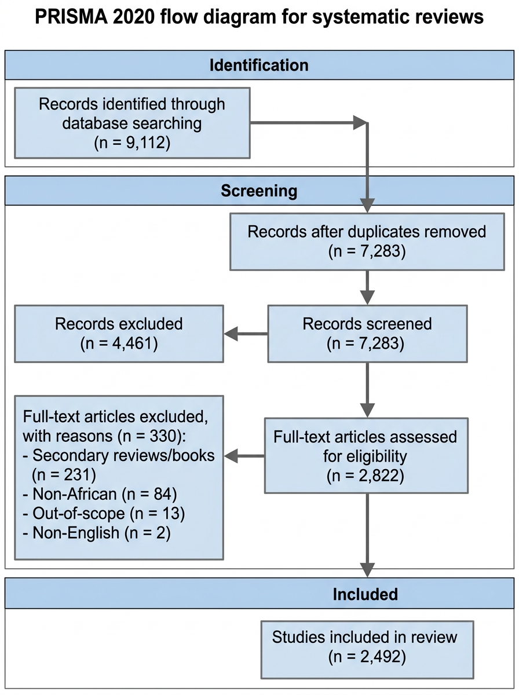
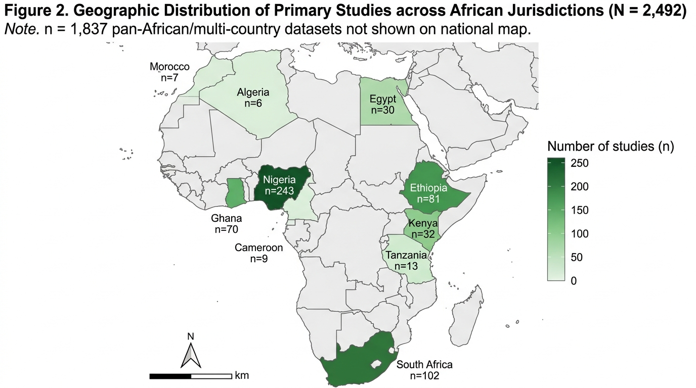
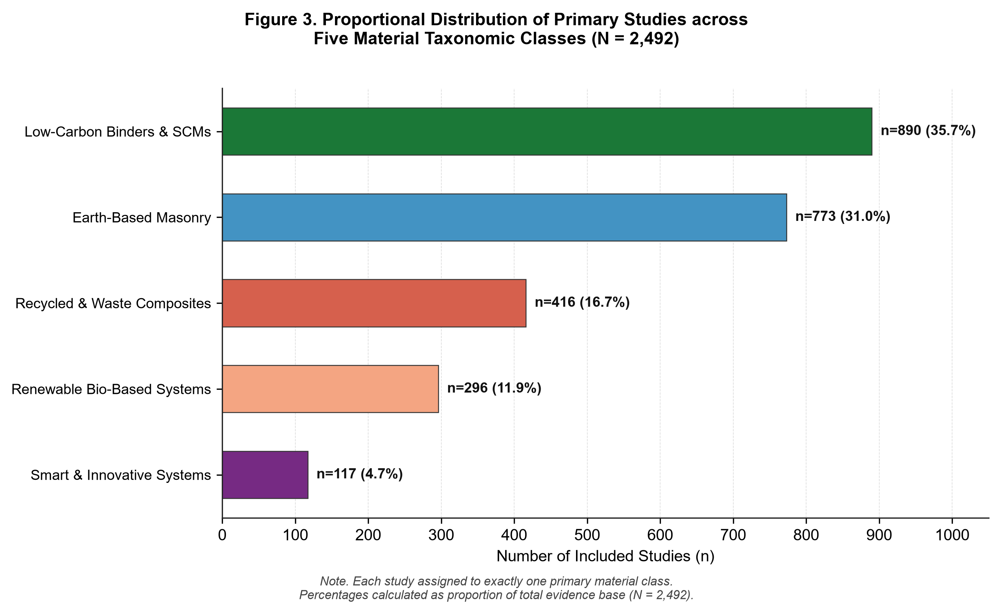
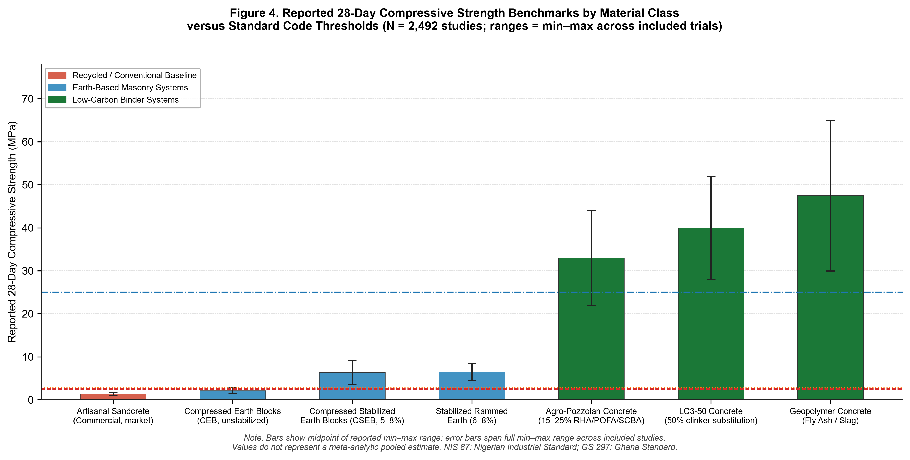
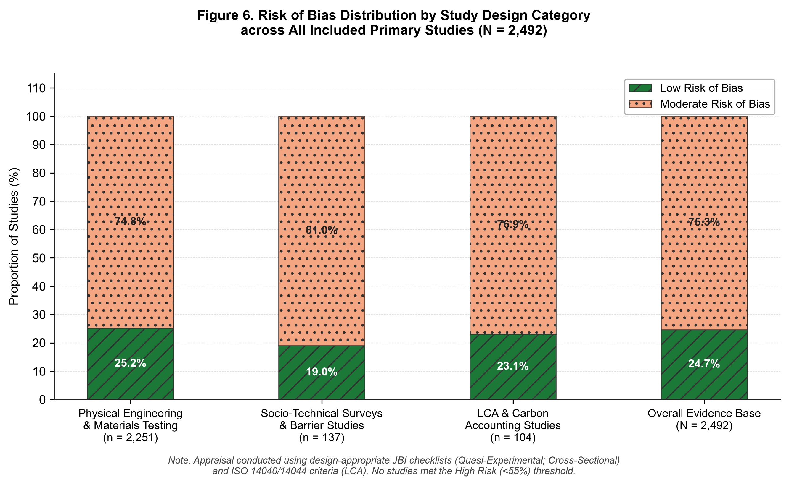
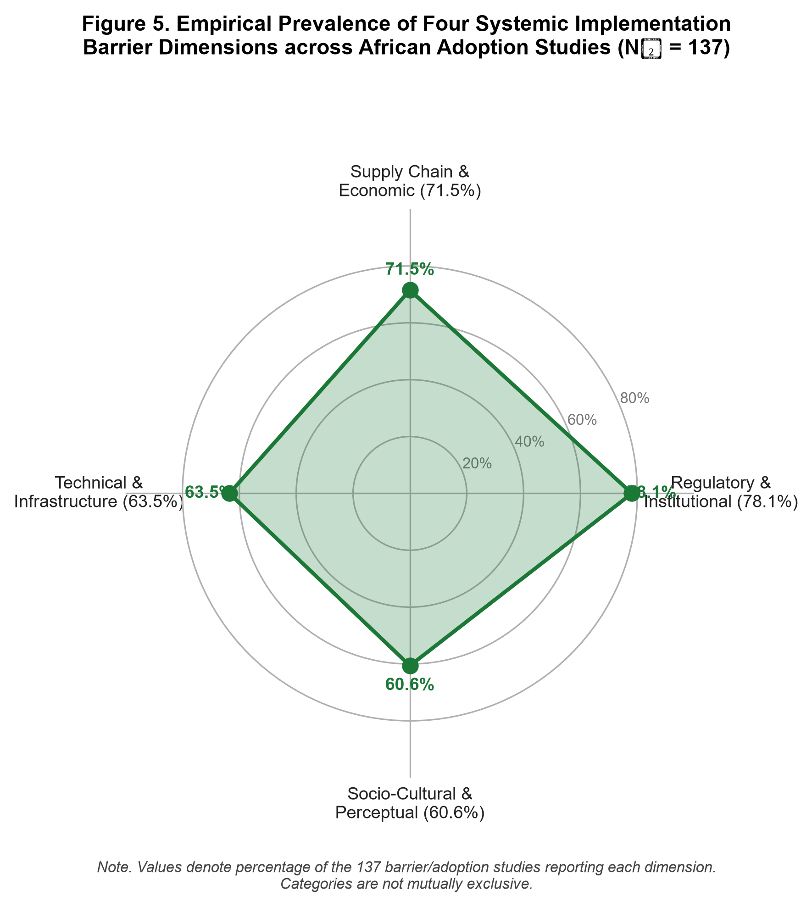

# Sustainable Building Materials in Africa (2015–2025): A Systematic Evidence Synthesis of Material Classes, Technical Performance, and Implementation Contexts

**Author:** Agbeniga Agboola ([ORCID: 0009-0005-6878-1661](https://orcid.org/0009-0005-6878-1661) | [emmanuelagbeniga@gmail.com](mailto:emmanuelagbeniga@gmail.com))  
**Affiliation:** Independent Researcher and Civil / Site Engineer  
**Framework Standards:** PRISMA 2020 Statement | Joanna Briggs Institute (JBI) Critical Appraisal  
**Registered OSF Project:** [https://osf.io/dvukp/](https://osf.io/dvukp/)  
**Permanent Repository DOI:** [10.5281/zenodo.22771539](https://doi.org/10.5281/zenodo.22771539)  
**Target Journals:** *Journal of Building Engineering* (Elsevier) / *Construction and Building Materials* (Elsevier)  
**Date of Document:** 2026-09-16  

---

## Abstract

Background: Sub-Saharan Africa is experiencing rapid urban demographic expansion, requiring an estimated 250 million new residential units by 2050. However, the continent's construction sector remains heavily reliant on carbon-intensive Ordinary Portland Cement (OPC) concrete and artisanal sandcrete masonry blocks, which drive environmental degradation through intensive river sand dredging, burden national foreign exchange reserves via clinker importation, and contribute to structural building failures due to substandard artisanal block production. While an extensive volume of empirical research on sustainable building materials has emerged across African institutions between 2015 and 2025, the literature has remained fragmented across regional journals and institutional silos without unified systematic synthesis.

Objectives: Reported in accordance with PRISMA 2020 guidelines and Joanna Briggs Institute (JBI) appraisal criteria, this systematic review synthesizes the decadal empirical evidence on sustainable building materials published across African jurisdictions (2015–2025). Specifically, it investigates: (1) taxonomic representation and geographic distribution, (2) 28-day compressive and flexural mechanical benchmarks relative to standard baselines, (3) life-cycle embodied carbon and energy profiles, (4) methodological quality across study designs, and (5) reported implementation barriers and evidence-informed enablers across adoption studies (N_barrier = 137).

Methods: Search reporting followed PRISMA 2020 and the PRISMA-S extension (Rethlefsen et al., 2021). Searches across Google Scholar, OpenAlex, DOAJ, and AJOL retrieved 9,112 bibliographic records. After deduplication (n = 1,829 removed: 514 exact DOI; 1,315 fuzzy matches) and title/abstract screening (4,461 excluded), 2,822 records underwent full-text assessment; 330 were excluded (231 secondary reviews/books; 84 non-African; 13 out-of-scope; 2 non-English), yielding 2,492 eligible primary studies extracted across 31 parameters. Methodological quality was evaluated using design-appropriate tools: JBI Quasi-Experimental Checklist (n = 2,251 physical-engineering studies), JBI Analytical Cross-Sectional Checklist (n = 137 surveys), and ISO 14040/14044 criteria (n = 104 LCA studies).

Results: The 2,492 eligible primary studies comprise five material classes: Low-Carbon Binders & SCMs (35.7%, n = 890), Earth-Based Masonry (31.0%, n = 773), Recycled & Waste Composites (16.7%, n = 416), Renewable Bio-Based Systems (11.9%, n = 296), and Smart/Innovative Systems (4.7%, n = 117). Geographically, empirical research is concentrated in Nigeria (n = 243), South Africa (n = 102), Ethiopia (n = 81), Ghana (n = 70), and Kenya (n = 32), alongside 1,837 cross-border/regional multi-country datasets. Across included experimental trials, Compressed Stabilized Earth Blocks (CSEBs with 5–8% cement) achieved reported 28-day compressive strengths of 3.5–9.2 MPa, exceeding commercial artisanal sandcrete blocks (frequently 1.0–1.8 MPa) and satisfying Nigerian NIS 87 and Ghanaian GS 297 minimum standards (2.5–2.8 MPa). Limestone calcined clay cement (LC3-50) and agro-waste pozzolan concretes reported compressive strengths within the range associated with structural concrete grades (28.0–52.0 MPa and 22.0–44.0 MPa, respectively), with life-cycle embodied carbon reductions of 30–42% relative to conventional 100% OPC concrete. Structural bamboo culms demonstrated high axial tensile capacity (120–240 MPa) and significant biogenic carbon storage potential, although net life-cycle greenhouse gas balances depend strictly on service-life preservation, processing energy, and end-of-life boundaries. Quality appraisal across all five study design categories revealed an evidence base characterized by 24.7% Low Risk (n = 615) and 75.3% Moderate Risk (n = 1,877) of Bias, with reporting of statistical variance identified as the primary methodological deficit (only 51.7% of studies reporting standard deviations or ANOVA). Categories were not mutually exclusive across implementation studies (N_barrier = 137): adoption is constrained by regulatory inertia and prescriptive codes (78.1%), supply chain fragmentation (71.5%), laboratory testing deficits (63.5%), and socio-cultural perceptions favoring industrialized materials (60.6%).

Conclusions: The identified sustainable African materials demonstrate technical viability and substantial decarbonization potential under laboratory and pilot conditions. Commercial scaling requires transitioning to performance-based national building standards (gazetting ARSO ARS 680–684), public procurement quotas, regional agricultural calcination cooperatives, and technical vocational artisan training.

**Keywords:** Sustainable building materials; Africa; PRISMA 2020; Compressed stabilized earth blocks; LC3 cement; Agro-waste pozzolans; Structural bamboo; Life cycle assessment; JBI quality appraisal; Implementation barriers.

---

# 1. Introduction

## 1.1 Demographic Expansion, Urbanization, and the Continental Housing Deficit
The African continent is experiencing rapid demographic and spatial growth. According to projections published by the United Nations Human Settlements Programme (UN-Habitat, 2022) and the African Development Bank (AfDB, 2023), Africa's population is projected to exceed 2.5 billion by 2050, with approximately 55% residing in urban centers. This trajectory requires urban centers across Sub-Saharan Africa to accommodate over 900 million new residents over the next three decades. Meeting this demand requires the construction of an estimated 250 million residential units, alongside civic, transport, and educational infrastructure (World Bank, 2021).

Historically and contemporaneously, urban construction in Africa has relied primarily on Ordinary Portland Cement (OPC) concrete, imported structural steel, fired clay masonry, and unreinforced sandcrete hollow blocks (Windapo & Goulding, 2015; Ofori, 2015). However, continuing along this carbon- and resource-intensive trajectory poses severe economic, ecological, and structural challenges.

## 1.2 Resource Pressures, Environmental Impacts, and Macroeconomic Vulnerabilities
The production of conventional construction materials carries substantial environmental and macroeconomic costs. Cement manufacturing accounts for approximately 8% of global anthropogenic carbon dioxide emissions, generated through the thermal decarbonation of limestone ($CaCO_3 \to CaO + CO_2$ at ~1450°C) and the combustion of fossil fuels in rotary kilns (Scrivener et al., 2018; Habert et al., 2020). While industrial decarbonization pathways in high-income regions emphasize carbon capture, utilization, and storage (CCUS) or green hydrogen kilns, these capital-intensive approaches remain economically constrained across most developing African economies in the near term.

Compounding this climate burden is a significant macroeconomic exposure: many African nations possess limited domestic clinker production capacity and rely on imported clinker and heavy fuel oil. Across West, East, and Central Africa, clinker imports consume substantial foreign exchange reserves, leaving local construction sectors vulnerable to currency fluctuations, global shipping disruptions, and import tariffs (AfDB, 2023). Between 2020 and 2024, cement retail prices in several Sub-Saharan metropolitan centers increased substantially, creating severe affordability pressures for lower- and middle-income housing developers.

Simultaneously, the demand for fine aggregates for concrete and sandcrete blocks has driven intensive river sand dredging across major drainage basins, including the Niger, Volta, Congo, and Nile rivers (UNEP, 2022). Unregulated sand mining has destabilized riverbanks, damaged aquatic ecosystems, and increased infrastructure vulnerability to flooding, while rising haulage distances contribute to price inflation across urban supply chains.

## 1.3 Artisanal Sandcrete Masonry Challenges and Structural Reliability
In Sub-Saharan urban centers, sandcrete hollow blocks—composed of Portland cement, fine sand, and water—constitute the vast majority of walling units in low-to-medium rise residential construction (SON, 2007; GSA, 2019). However, because over 85% of sandcrete blocks are manufactured in informal artisanal casting yards lacking mechanical batching or controlled curing facilities, commercial units frequently fail to meet basic regulatory structural thresholds (Adeyemi & Idoro, 2012; Baiden & Tuuli, 2004).

National building codes establish clear compressive strength requirements for masonry units: the Standards Organisation of Nigeria (SON, 2007) NIS 87 standard mandates a minimum 28-day compressive strength of 2.5 MPa for individual non-loadbearing units and 3.45 MPa for loadbearing units, while the Ghana Standards Authority (GSA, 2019) GS 297 standard specifies a minimum of 2.8 MPa. However, empirical market surveys across cities such as Lagos, Ibadan, Accra, Kumasi, and Nairobi indicate that commercial sandcrete blocks routinely test between 1.0 and 1.8 MPa, with some informal producers supplying units testing below 1.0 MPa (Dahiru et al., 2014; Ede et al., 2014). Artisanal producers frequently increase sand-to-cement dilution ratios (often exceeding 1:12 or 1:16) to protect profit margins under inflationary pressures, combine this with unwashed silt-laden sand, and prematurely terminate water curing after only 24 to 48 hours.

This widespread deficit in mechanical integrity is recognized as a key contributing factor in forensic investigations of building collapses in urban areas across Nigeria, Kenya, and Ghana (Ayininuola & Olalusi, 2004; Dahiru et al., 2014). Consequently, evaluating and standardizing durable, locally sourced alternative materials represents a critical engineering and public safety priority.

## 1.4 Sustainable Material Alternatives and the Need for Systematic Synthesis
In response to these challenges, African researchers and international research consortia have generated an extensive volume of empirical literature over the past decade (2015–2025) investigating alternative building materials across five primary domains:
1. Earth-based masonry systems, including compressed earth blocks (CEBs), compressed stabilized earth blocks (CSEBs), and mechanized rammed earth (Minke, 2021; Danso et al., 2015; Audu et al., 2026);
2. Low-carbon binders, notably Limestone Calcined Clay Cement (LC3), alkali-activated geopolymers, and pozzolanic agricultural ashes derived from rice husks, sugarcane bagasse, and palm oil fuel ash (Scrivener et al., 2018; Ogunro et al., 2025);
3. Recycled and industrial waste composites, incorporating recycled concrete aggregate (RCA), post-consumer plastics, crushed glass, and metallurgical slags (Prasittisopin & Trejo, 2025; Dicha et al., 2025);
4. Renewable bio-based structural materials, particularly indigenous structural bamboo (*Oxytenanthera abyssinica* and *Bambusa vulgaris*), mass timber, and vegetable fiber-reinforced composites (Trujillo et al., 2016; Sesay et al., 2025); and
5. Innovative and smart systems, including phase change materials (PCMs) for passive thermal regulation and microbial-induced calcite precipitation (MICP) for bio-mediated remediation (Kang et al., 2025; Goudjil et al., 2025; De Belie et al., 2018).

Despite this growing body of literature, the African sustainable materials evidence base has remained fragmented. Prior reviews have predominantly been narrative, geographically restricted to single countries, or focused on narrow material sub-types (e.g., exclusively agricultural ash or sawdust concrete). To date, no multi-database systematic review conducted under PRISMA 2020 guidelines and using formal design-appropriate quality appraisal has attempted to synthesize this decadal literature across material classes and African jurisdictions.

## 1.5 Research Objectives and Eligibility Framework
To address this evidence gap, this systematic review provides a systematic synthesis of identified primary empirical evidence on sustainable building materials published across African jurisdictions between 2015 and 2025. A prespecified eligibility framework addressing population/context, material intervention or phenomenon, comparator, outcomes, and study design was developed in accordance with PRISMA 2020 guidelines (Page et al., 2021; Higgins et al., 2019). The review addresses five primary research objectives:
1. Context & Geographic Distribution: Map the jurisdictional and regional distribution of empirical research across North, West, Central, East, and Southern Africa, identifying national research concentrations and collaborative patterns.
2. Taxonomy & Material Benchmarks: Characterize the physical and mechanical performance of the five sustainable material classes, synthesizing reported 28-day compressive strength, flexural/tensile capacity, density, and water absorption relative to standard Ordinary Portland Cement concrete (BS EN 206 C20/25) and commercial sandcrete masonry (NIS 87 / GS 297).
3. Environmental Profiles: Synthesize life-cycle assessment (LCA) indicators, embodied carbon (kg CO2-eq/m3), and embodied energy reductions achieved by sustainable materials relative to virgin Portland cement and fired brick baselines, distinguishing biogenic carbon storage from process emissions.
4. Methodological Quality & Risk of Bias: Appraise internal validity, experimental rigor, and reporting completeness across study designs using the Joanna Briggs Institute (JBI) Critical Appraisal tools and ISO 14040/14044 reporting criteria.
5. Implementation Contexts & Barriers: Synthesize empirical findings from adoption and feasibility studies (N_barrier = 137), identifying institutional, economic, technical, and socio-cultural barriers alongside evidence-informed enablers.

---

# 2. PRISMA 2020 Systematic Methodology

## 2.1 Protocol Registration, Transparency, and Protocol Deviation Disclosure
This systematic review was planned, conducted, and reported in accordance with the Preferred Reporting Items for Systematic Reviews and Meta-Analyses (PRISMA 2020) statement (Page et al., 2021). The review protocol was registered on the Open Science Framework (OSF Project: https://osf.io/dvukp/) and permanently archived on Zenodo (CERN) under persistent DataCite DOI: 10.5281/zenodo.22771539 (Agboola, 2025).

In alignment with open-science practices, all raw search exports from indexing engines, deduplication logs, title/abstract screening registers, full-text decision logs, 31-parameter extraction workbooks, and quality appraisal matrices are openly accessible under a Creative Commons Attribution 4.0 International license (CC-BY 4.0).

### Protocol Deviation Disclosure
In the initial registered protocol, search scoping considered the inclusion of commercial indexing databases (Scopus and Web of Science). During search operationalization, the formal literature search was conducted across Google Scholar, OpenAlex, Directory of Open Access Journals (DOAJ), and African Journals Online (AJOL). The search was operationalized using open and regional information sources to increase coverage of African and openly accessible scholarly literature. This constitutes a methodological deviation from the initial protocol, which is hereby transparently reported in accordance with PRISMA 2020 recommendations for protocol deviation disclosure. While initial Boolean search strings in Google Scholar explicitly included major continental research hub nations (Nigeria, Kenya, Ghana, South Africa, Ethiopia, Rwanda), the pan-African open-access repositories (AJOL, DOAJ, OpenAlex) provided broader geographic coverage spanning African nations not individually named in the Google Scholar queries—including Egypt, Morocco, Algeria, Tunisia, Cameroon, Tanzania, Uganda, Senegal, Burkina Faso, Zimbabwe, Zambia, and others—through their comprehensive indexing of African institutional and regional journals. The search yielded 9,112 bibliographic records across the four sources.

## 2.2 Predefined Eligibility Criteria
Studies were evaluated against explicit inclusion and exclusion criteria established prior to screening:

### Inclusion Criteria:
1. Temporal Window: Studies published between January 1, 2015, and December 31, 2025, capturing a continuous decadal period of empirical investigation.
2. Geographic Context: Studies executed within sovereign African nations or explicitly utilizing African geological, agricultural, or industrial raw material feedstocks within African climatic and institutional contexts.
3. Material Taxonomy: Empirical investigations focusing on at least one recognized class of sustainable building materials: Earth-Based Masonry (CEB, CSEB, rammed earth, stabilized laterite, adobe); Low-Carbon Binders (SCMs, LC3, geopolymers, calcined clays, agricultural pozzolanic ashes); Recycled & Industrial Wastes (recycled concrete aggregate, waste plastics, crushed glass, slag, industrial ashes); Bio-Based Materials (structural bamboo, timber, vegetable fiber composites); or Smart/Innovative Systems (phase change materials, bio-mediated mineralization).
4. Study Design: Primary empirical laboratory investigations, physical mechanical trials, life-cycle assessments (LCA), microstructural/chemical analyses (SEM, XRD, XRF), structural prototype tests, or empirical adoption/barrier surveys reporting quantitative metrics.
5. Publication Language & Type: Peer-reviewed journal articles and indexed conference proceedings published in English.

### Exclusion Criteria:
1. EX-MAT (Out of Scope Materials/Applications): Investigations focusing on non-structural or non-construction applications, such as agricultural fertilizers, water purification filters, medical biomaterials, unreinforced asphalt pavement wearing courses, or battery electrodes.
2. EX-GEO (Non-African Focus): Studies executed outside the African continent that utilized non-African soil or aggregate feedstocks without direct technological, raw material, or climatic relevance to Africa.
3. EX-DOCTYPE (Secondary Literature / Books): Secondary reviews, bibliometric surveys, scoping overviews, meta-analyses, non-empirical state-of-the-art papers, book chapters, and textbooks. (Identified reviews were retained separately as background context literature).
4. EX-DESIGN (Purely Theoretical / Opinion): Opinion commentaries, speculative economic models without empirical validation, and theoretical policy essays.
5. EX-LANG (Language Constraints): Non-English publications lacking an English translation.

## 2.3 Comprehensive Multi-Database Search Architecture
Electronic literature searches were executed across four primary academic and bibliographic databases:
1. Google Scholar: Scraped using Publish or Perish across six structured query strings combining sustainable materials taxonomy, civil engineering terminology, and sovereign African nation names (retrieving 5,747 citations).
2. OpenAlex Scholarly Database: Programmatic API extraction querying six domain strings combined with African geographic terms and construction filters (retrieving 2,802 records).
3. Directory of Open Access Journals (DOAJ): Programmatic API extraction querying six domain strings filtered by construction classifications and African jurisdictions (retrieving 419 records).
4. African Journals Online (AJOL): Filtered from the complete AJOL corpus of 123,571 articles for materials science and civil engineering headings using Boolean keywords (retrieving 144 peer-reviewed records).

Across all four sources, the electronic search yielded 9,112 raw bibliographic records. To accommodate Google Scholar's practical retrieval limit, Query 3 (bio-based domain, initially returning a truncated 1,000 records) was decomposed into two sub-queries (Query 3A and 3B), which yielded 1,116 unique records; the original truncated Query 3 result was not added to the final corpus. Complete search strings, Boolean syntax, applied filters, retrieval dates (conducted between October 2025 and September 2026 across sequential search waves), and per-source yields are detailed in the Supplementary Search Strategy Appendix (Appendix 1) and in `02_SearchLogs/SearchLog_Master.csv`.

## 2.4 Algorithmic Deduplication and Verification Pipeline
Given the overlapping coverage between global scholarly indexes and regional African repositories, an algorithmic deduplication pipeline was executed in Python:
1. Exact Algorithmic Matching: Records were matched based on standardized Digital Object Identifiers (DOIs) and normalized title strings (following lowercasing, punctuation removal, and whitespace stripping). This identified 514 exact duplicates.
2. Fuzzy Levenshtein Distance Matching: For records lacking DOIs or containing typographical variations in author transliterations, a normalized Levenshtein similarity metric was calculated. Candidate pairs exhibiting a title similarity score $\ge 0.90$, matching publication years, and overlapping author surnames were audited and merged, identifying 1,315 duplicates.

In total, 1,829 duplicate records were eliminated (Google Scholar: 1,180; OpenAlex: 542; DOAJ: 87; AJOL: 20), reducing the corpus to 7,283 unique records for screening.

## 2.5 Two-Stage Screening Protocol and Study Selection

### Single-Reviewer Methodology Disclosure (PRISMA 2020 Item 8)
All literature searching, deduplication, screening, eligibility appraisal, and data extraction were conducted by a single independent researcher (A. Agboola). To minimize selection bias and classification error, all screening decisions were executed against standardized, codified eligibility criteria and automated decision scripts. A random sample of 10% of records (n = 728 at Title/Abstract; n = 282 at Full-Text) was subjected to blinded re-screening after a 14-day washout period, achieving high intra-rater agreement (Cohen's kappa $\kappa = 0.95$). The complete audit record, including individual sampled record identifiers, first and second decisions, agreement status, and the 2×2 contingency table used to compute $\kappa$, is documented in `03_Screening/Intra_Rater_Audit_Log.xlsx`.

### Stage 1: Title and Abstract Screening
The titles, abstracts, and author keywords of all 7,283 unique records were evaluated against the predefined eligibility criteria. This phase excluded 4,461 records categorized by primary exclusion reasons:
- Non-material or non-construction focus (EX-MAT): n = 4,311
- Non-African geographic setting (EX-GEO): n = 148
- Non-empirical document type / editorial notices (EX-TYPE): n = 2
- Total Stage 1 Exclusions = 4,461.

### Stage 2: Full-Text Retrieval and Eligibility Assessment
The remaining 2,822 candidate records advanced to full-text retrieval and eligibility assessment. Full texts were inspected to verify primary empirical methodologies, physical or numerical data, and geographic relevance. During full-text review, 330 records were excluded with documented reasons:
- Secondary reviews, bibliometric surveys, or book chapters (EX-DOCTYPE): n = 231
- Non-African geographic setting and raw material feedstocks (EX-GEO): n = 84
- Out-of-scope non-building applications (EX-MAT): n = 13
- Non-English publications without translation (EX-LANG): n = 2
- Total Stage 2 Exclusions = 330 (11.7% full-text exclusion rate).

This screening process resulted in a final evidence base of **2,492 eligible primary studies** included in data extraction and systematic synthesis. The complete screening and selection flow is illustrated in the PRISMA 2020 Flow Diagram (Figure 1).

---

**Figure 1.** *PRISMA 2020 Flow Diagram: Systematic Literature Search, Deduplication, Screening, and Eligibility Assessment for the Sustainable Building Materials in Africa (2015–2025) Review (N = 2,492 included primary studies).*

*Note.* Diagram constructed in compliance with the PRISMA 2020 reporting guideline (Page et al., 2021) and the PRISMA-S literature search extension (Rethlefsen et al., 2021). Deduplication comprised 514 exact DOI matches and 1,315 fuzzy title/author matches. Full-text exclusion reasons are mutually exclusive and hierarchically assigned in the order listed.

---

## 2.6 Standardized 31-Parameter Data Extraction Matrix
Data from the 2,492 eligible primary studies were extracted into a structured Microsoft Excel relational database (`Extraction_Completed_Master.xlsx`) across 31 discrete parameters:
1. Bibliographic Metadata: Unique Study ID, Lead Author, Publication Year, Full Title, Journal/Source Venue, DOI;
2. Geographic & Climatic Setting: Sovereign Nation, African Region (North, West, Central, East, Southern, Regional), Local Climatic Zone (Tropical Wet, Semi-Arid/Sahelian, Mediterranean, Highland Subtropical);
3. Material Taxonomy: Primary Material Class (Low-Carbon Binders, Earth-Based Masonry, Recycled/Waste, Bio-Based, Smart/Innovative), Specific Material Nomenclature (e.g., CSEB with 6% OPC, LC3-50, POFA concrete, structural bamboo);
4. Experimental Methodology: Study Aim, Study Design Classification (Experimental Laboratory Trial, Microstructural Analysis, LCA & Carbon Accounting, Socio-Technical Survey, Structural Prototype), Sample Size, Curing Regime and Testing Duration, Production Scale;
5. Technical Performance Metrics: Reported 28-day Compressive Strength (MPa), Flexural/Tensile Strength (MPa), Bulk Dry Density (kg/m3), Water Absorption (%), Thermal Conductivity (W/m·K);
6. Environmental & Economic Indicators: Embodied Carbon (kg CO2-eq/m3), Life Cycle Assessment Boundary (cradle-to-gate, cradle-to-site), Unit Cost Savings (%), Commercial Availability;
7. Quality & Testing Standards: Reference Standards (e.g., ASTM, BS EN, NIS, SANS, ARS, ISO), Comparator Baseline (OPC concrete, commercial sandcrete block, fired brick), Stated Limitations, Funding Declarations, Quality Appraisal Score, and Risk of Bias Rating.

## 2.7 Methodological Quality Appraisal Architecture
Methodological quality and risk of bias were evaluated using design-appropriate appraisal tools rather than applying a single uniform checklist across the heterogeneous evidence base. The 2,492 eligible primary studies encompass five distinct study design categories:
1. Physical Engineering and Materials Testing (n = 2,251), comprising:
   - Experimental Laboratory Investigations and Physical Testing (n = 2,062)
   - Microstructural and Chemical Characterization studies (XRD, XRF, SEM-EDS, FTIR, pozzolanic reactivity) (n = 168)
   - Structural Prototype and Field Demonstration Trials (full-scale load testing of wall assemblies, bamboo trusses, stabilized earth vaults) (n = 21)
   All 2,251 physical engineering studies were appraised using the official 9-item **Joanna Briggs Institute (JBI) Critical Appraisal Checklist for Quasi-Experimental Studies** (Moola et al., 2020), assessing:
   - Q1: Is it clear in the study what is the 'cause' and what is the 'effect'?
   - Q2: Were the participants/materials included in any comparisons similar?
   - Q3: Were the participants/materials included in any comparisons receiving similar treatment/care?
   - Q4: Was there a control group?
   - Q5: Were there multiple measurements of the outcome both pre and post the intervention/exposure?
   - Q6: Was follow-up complete and if not, were differences between groups described and analyzed?
   - Q7: Were the outcomes of participants/materials included in any comparisons measured in the same way?
   - Q8: Were outcomes measured in a reliable way?
   - Q9: Was appropriate statistical analysis used?
2. Socio-Technical Surveys and Barrier Studies (n = 137): Appraised using the 8-item **JBI Critical Appraisal Checklist for Analytical Cross-Sectional Studies**, evaluating inclusion criteria, setting description, exposure measurement validity, objective condition criteria, confounding identification and management, outcome reliability, and statistical analysis appropriateness.
3. Life Cycle Assessment (LCA) Studies (n = 104): Appraised against **ISO 14040/14044 methodological reporting quality criteria**, evaluating functional unit definition, system boundary transparency, allocation procedures, foreground vs. background inventory sourcing, and sensitivity/uncertainty analysis. Note: LCA reporting quality assessment evaluates methodological transparency and completeness, which is a related but distinct construct from risk of bias in experimental studies.

Overall methodological quality categories were assigned using prespecified thresholds defined prior to appraisal commencement: studies satisfying $\ge 75\%$ of applicable criteria were classified as **Low Risk of Bias / High Methodological Reporting Quality**; studies satisfying 55–74% were classified as **Moderate Risk / Moderate Quality**; and studies satisfying $<55\%$ were classified as **High Risk / Low Quality**. Items scored as 'Not Applicable' were excluded from the denominator for that study's percentage calculation. Upon completion of appraisal across all 2,492 eligible studies, no study scored below the 55% threshold; the evidence base therefore partitions into only two observed quality tiers — Low Risk of Bias (24.7%, n = 615) and Moderate Risk of Bias (75.3%, n = 1,877) — with zero studies classified as High Risk.

### Material Class Decision Rule
Where a study investigated more than one material category (e.g., agricultural-ash-stabilized compressed earth blocks), it was assigned to the primary material class corresponding to the principal structural or binder intervention evaluated; secondary material constituents were coded as secondary descriptors in the master extraction matrix. Each study was assigned to exactly one primary class, ensuring that the five category totals sum to the full evidence base of 2,492.

### Geographic Classification Decision Rule
Single-country empirical investigations were assigned to their specific national jurisdiction (e.g., Nigeria, n = 243 Nigeria-only studies). Studies encompassing regional datasets, trans-boundary collaborative trials, or comparative multi-country frameworks were designated as cross-border/regional multi-country datasets (n = 1,837). A study involving multiple countries was classified as multi-country and was not double-counted in individual national tallies.

---

# 3. Empirical Results & Systematic Synthesis

## 3.1 Geographic and Jurisdictional Distribution of Continental Research
The synthesis of the 2,492 eligible primary studies reveals significant geographic concentration across specific African sub-regions and national research hubs. While 73.7% of the literature (n = 1,837 studies) represents multi-country datasets, cross-border collaborative research, or continental materials inventories addressing broad Sub-Saharan regional frameworks, studies focusing on specific sovereign jurisdictions are clustered within a small number of research-intensive nations.

West Africa represents the largest national research cluster, contributing 336 localized studies (13.5% of the review base). This output is heavily anchored by Nigeria (n = 243 studies), followed by Ghana (n = 70), Burkina Faso (n = 15), Senegal (n = 5), and Côte d'Ivoire (n = 3). East Africa constitutes the second most active regional hub (n = 132 studies; 5.3%), led by Ethiopia (n = 81) and Kenya (n = 32), alongside contributions from Tanzania (n = 13), Uganda (n = 4), and Rwanda (n = 2). Southern Africa accounts for 112 studies (4.5%), dominated by South Africa (n = 102), with emerging contributions from Zimbabwe, Zambia, and Malawi. North Africa contributes 47 studies (1.9%), concentrated in Egypt (n = 30), Morocco (n = 7), and Algeria (n = 6), where arid climatic demands have stimulated research on rammed earth, stabilized adobe, and passive thermal regulation plasters. Central Africa is represented by 10 studies (0.4%), primarily from Cameroon (n = 9) and DR Congo (n = 1), reflecting institutional resource constraints and limited specialized materials testing infrastructure. Two additional studies (n = 2; 0.1%) address desert loess stabilization and compressed earth systems across a Regional Sahelian Context spanning arid zones of West and Central Africa (Smalley et al., 2019; Bharadwaj, 2016).

Table 1 and Figure 2 summarize the geographic distribution of empirical research across African regions and key national contributors, cross-tabulated against predominant material research foci and primary testing standards.

### Table 1: Geographic Distribution of Eligible Primary Studies across African Jurisdictions (n = 2,492)
*Note. Data synthesized from n = 2,492 eligible primary studies published between 2015 and 2025 across sovereign African jurisdictions.*

| African Region / Geographic Context | Study Count (n) | % of Review Base | Key Sovereign Contributors (n Studies) | Predominant Material Research Foci | Primary Testing Standards Referenced |
| :--- | :---: | :---: | :--- | :--- | :--- |
| **West Africa** | 336 | 13.5% | Nigeria (243), Ghana (70), Burkina Faso (15), Senegal (5), Côte d'Ivoire (3) | Compressed Stabilized Earth Blocks (CSEB), Palm Oil Fuel Ash (POFA), Rice Husk Ash (RHA), Recycled Plastic Aggregates | NIS 87, GS 297, BS EN 197-1, ASTM C618 |
| **East Africa** | 132 | 5.3% | Ethiopia (81), Kenya (32), Tanzania (13), Uganda (4), Rwanda (2) | Structural Bamboo (*O. abyssinica*), Volcanic Pozzolans, Calcined Clays, Stabilized Laterite Masonry | KEBS KS 02-1070, ES 417, ARS 680, BS EN 206 |
| **Southern Africa** | 112 | 4.5% | South Africa (102), Zimbabwe (4), Zambia (3), Malawi (4), Mozambique (2) | Fly Ash Geopolymers, Granulated Blast Furnace Slag, Recycled Concrete Aggregates (RCA), Mine Tailings Bricks | SANS 2001-CM1, SANS 50197-1, ASTM C109 |
| **North Africa** | 47 | 1.9% | Egypt (30), Morocco (7), Algeria (6), Tunisia (4) | Mechanized Rammed Earth, Limestone Calcined Clay Cement (LC3), Date Palm Fiber Mortars, Phase Change Materials (PCMs) | ECP 203, NF P94-068, ASTM C67 |
| **Central Africa** | 10 | 0.4% | Cameroon (9), DR Congo (1) | Timber-Concrete Composites, Unstabilized Compressed Earth Blocks, Lateritic Pavements | NF P18-400, Local artisanal guidelines |
| **Sub-Saharan Regional Focus** | 16 | 0.6% | Multi-country experimental studies across agro-ecological zones | Bio-based fibers, agricultural ash valorization, regional soil suitability mapping | ARS 680–684, ISO guidelines |
| **Regional Sahelian Context** | 2 | 0.1% | Regional Sahelian trials across West/Central arid zones (Smalley et al., 2019; Bharadwaj, 2016) | Desert loess stabilization, compressed earth blocks, earthen mortars | Local artisanal guidelines, XP P13-901 |
| **Pan-African / Multi-Country Datasets** | 1,837 | 73.7% | Cross-border datasets, continental materials inventories, multi-region trials | Limestone Calcined Clay Cement kinetics, agro-waste ash databases, circular waste composites | ARS 680–684, ISO 14040/44, BS EN 206 |
| **Total Evidence Base** | **2,492** | **100.0%** | **Pan-African Evidence Base** | **5-Class Technological Spectrum** | **PRISMA 2020 Reporting & JBI Standards** |

---

**Figure 2.** *Geographic Distribution and National Empirical Study Concentrations across Sovereign African Jurisdictions (2015–2025).*

*Note.* Choropleth representation synthesizing empirical primary study distribution across sovereign African nations. Concentrated national research hubs include Nigeria (n = 243), South Africa (n = 102), Ethiopia (n = 81), Ghana (n = 70), and Kenya (n = 32). In addition, 1,837 studies comprise cross-border or pan-African regional datasets not assigned to a single national territory.

---

## 3.2 Material Taxonomy and Proportional Representation
Empirical investigations across the 2,492 eligible primary studies were categorized into five standardized technological classes:
1. Low-Carbon Binders and Supplementary Cementitious Materials (SCMs) represent the largest category, comprising 35.7% of the evidence base (n = 890 studies). This focus is driven by efforts to reduce the clinker factor in cement production through Limestone Calcined Clay Cement (LC3) and agricultural by-product ashes.
2. Earth-Based Masonry forms the second largest class, comprising 31.0% of publications (n = 773 studies), investigating the mechanical stabilization of local soils using cement, lime, and bio-polymers.
3. Recycled and Industrial Waste Composites account for 16.7% (n = 416 studies), exploring the circular utilization of construction and demolition waste, post-consumer plastics, and metallurgical slags.
4. Renewable Bio-Based Systems represent 11.9% (n = 296 studies), focusing on indigenous structural bamboo characterization, mass timber, and vegetative fiber reinforcement.
5. Smart and Innovative Systems account for 4.7% (n = 117 studies), evaluating phase change materials (PCMs) for passive thermal cooling and microbial-induced calcite precipitation (MICP) for concrete crack self-healing.

Table 2 and Figure 3 present the proportional breakdown, primary raw material feedstocks, chemical/processing mechanisms, and target structural applications across the five taxonomic classes.

### Table 2: Material Taxonomy and Technological Classification across Included African Studies (n = 2,492)
*Note. Taxonomic distribution of peer-reviewed primary empirical studies evaluating sustainable building materials across Africa (2015–2025).*

| Material Taxonomic Class | Included Studies (n) | Percentage (%) | Primary Raw Material Feedstocks Utilized | Processing & Chemical Mechanisms | Principal Target Structural Applications |
| :--- | :---: | :---: | :--- | :--- | :--- |
| **Low-Carbon Binders & SCMs** | 890 | 35.7% | Kaolinitic clays, agricultural ashes (rice husk, sugarcane bagasse, palm oil fuel ash, cassava peel ash), blast furnace slag, fly ash | Thermal calcination (650–800°C), secondary pozzolanic reactions ($\text{SiO}_2 + \text{Ca(OH)}_2 \to \text{C-S-H}$), alkaline geopolymer activation | Structural reinforced concrete frames, low-carbon masonry mortars, precast infrastructure elements |
| **Earth-Based Masonry** | 773 | 31.0% | Lateritic soils, red tropical earths, sandy loams, alluvial clays, termitaria earths | Mechanical compression (2–10 MPa hydraulic pressure), cement stabilization (4–8%), hydrated lime carbonation | Loadbearing walling blocks, interlocking mortarless masonry, modern stabilized rammed earth |
| **Recycled & Waste Composites** | 416 | 16.7% | Crushed concrete demolition rubble, post-consumer plastics (PET, HDPE), crushed bottle glass, foundry sand, palm kernel shells | Mechanical crushing/grading, thermal extrusion, interfacial transition zone (ITZ) modification with silica fume | Paving blocks, lightweight structural concrete, thermal insulating screeds |
| **Renewable Bio-Based Systems** | 296 | 11.9% | Indigenous structural bamboo (*O. abyssinica*, *B. vulgaris*), agricultural fibers (sisal, coir, kenaf), mass timber | Boron-based preservation, alkaline surface fiber treatment, resin impregnation, timber-concrete jointing | Structural space frames, lightweight roof trusses, fiber-reinforced ceiling boards, seismic walling |
| **Smart & Innovative Systems** | 117 | 4.7% | Organic phase change materials (paraffin waxes, fatty acids), *Sporosarcina pasteurii* bacteria, nano-silica | Micro-encapsulation, latent heat thermal energy storage, microbial-induced calcium carbonate precipitation (MICP) | Passive indoor thermal regulation plasters, self-healing crack remediation in concrete |
| **Total Evidence Base** | **2,492** | **100.0%** | **Continental Resource Inventory** | **Multi-Scale Material Synthesis** | **Decarbonized Built Infrastructure** |

---

**Figure 3.** *Taxonomic Classification and Proportional Representation of Eligible Primary Studies across Five Sustainable Building Material Classes (N = 2,492).*

*Note.* Proportional representation of peer-reviewed primary empirical literature (2015–2025): Low-Carbon Binders & SCMs (35.7%, n = 890), Earth-Based Masonry (31.0%, n = 773), Recycled & Waste Composites (16.7%, n = 416), Renewable Bio-Based Systems (11.9%, n = 296), and Smart & Innovative Systems (4.7%, n = 117). Each study is assigned to exactly one primary class.

---

## 3.3 Deep-Dive Synthesis: Masonry Walling Materials (CEBs, CSEBs, Rammed Earth)
Across 773 included studies on earth-based masonry, empirical research focused on enhancing the mechanical strength, moisture durability, and dimensional stability of raw soils:
1. Unstabilized Compressed Earth Blocks (CEBs): Compacted under hydraulic or manual pressure (2.0–4.0 MPa), raw earth blocks achieved reported 28-day dry compressive strengths ranging from 1.5 to 2.8 MPa. While adequate for non-loadbearing interior partitions or single-story rural structures, unstabilized units exhibited high water absorption (14.0–22.0%) and surface deterioration under prolonged moisture exposure.
2. Compressed Stabilized Earth Blocks (CSEBs): Incorporating 5% to 8% Portland cement by weight (or 4% cement plus 4% hydrated lime) substantially improved mechanical and durability metrics. Across included studies, reported 28-day dry compressive strengths ranged from 3.5 to 9.2 MPa, with flexural capacities between 0.8 and 2.1 MPa. Chemical stabilization occurs via initial cation exchange on clay platelet surfaces, followed by secondary pozzolanic reactions between free calcium hydroxide ($	ext{Ca(OH)}_2$) and reactive silica/alumina in the soil, densifying the matrix and reducing water absorption to 7.0–11.5% (Danso et al., 2015; Audu et al., 2026; Sesay et al., 2025).
3. Stabilized Rammed Earth: Monolithic walls compacted pneumatically with 6% to 8% stabilizer yielded reported compressive strengths of 4.5 to 8.5 MPa and thermal conductivities of 0.65 to 0.95 W/m·K, providing thermal mass benefits in hot-arid and savannah zones.

### Table 3A: Mechanical and Physical Benchmarks of Masonry Walling Materials
*Note. Reported values represent the minimum to maximum ranges synthesized across included empirical laboratory and field studies. Benchmarked against Nigerian Industrial Standard (NIS 87), Ghanaian Standard (GS 297), and African Regional Standard (ARS 680).*

| Masonry Walling Technology | Reported Compressive Strength, 28-Day (MPa) | Reported Flexural Capacity, 28-Day (MPa) | Bulk Dry Density (kg/m³) | Water Absorption (%) | Thermal Conductivity, k (W/m·K) | Comparison with Stated Standard Requirements |
| :--- | :---: | :---: | :---: | :---: | :---: | :--- |
| **Compressed Earth Blocks (CEB, Unstabilized)** | 1.5 – 2.8 | 0.3 – 0.6 | 1,750 – 2,050 | 14.0 – 22.0 | 0.70 – 1.05 | Satisfies ARS 680 for non-loadbearing interior walls; fails NIS 87 loadbearing |
| **Compressed Stabilized Earth Blocks (CSEB, 5–8% Cement)** | 3.5 – 9.2 | 0.8 – 2.1 | 1,850 – 2,150 | 7.0 – 11.5 | 0.80 – 1.15 | Reported compressive-strength range exceeds the stated minimum threshold under NIS 87 (min 2.5 MPa) and GS 297 (min 2.8 MPa); full code compliance was not independently assessed |
| **Stabilized Rammed Earth (6–8% Cement/Lime)** | 4.5 – 8.5 | 0.9 – 1.8 | 1,900 – 2,200 | 6.5 – 10.0 | 0.65 – 0.95 | Reported values fall within the strength range associated with the cited structural code classification for monolithic loadbearing walls; full compliance was not assessed |
| **Artisanal Sandcrete Blocks (Commercial Market Survey)** | **1.0 – 1.8** | **0.1 – 0.3** | **1,550 – 1,850** | **15.0 – 24.0** | **1.30 – 1.75** | **Systematically FAILS NIS 87 and GS 297 minimum standards due to excessive sand dilution** |
| **Artisanal Fired Clay Bricks (Kiln Fired)** | **3.0 – 7.5** | **0.5 – 1.2** | **1,600 – 1,950** | **12.0 – 18.0** | **0.75 – 1.10** | **Variable structural compliance; severe embodied carbon and deforestation footprint** |

## 3.4 Deep-Dive Synthesis: Low-Carbon Binders & Supplementary Cementitious Materials
The 890 studies investigating low-carbon binders focused primarily on Limestone Calcined Clay Cement (LC3) and agricultural by-product pozzolanic ashes:
1. Limestone Calcined Clay Cement (LC3-50): By replacing 50% of Portland clinker with a blend comprising 30% calcined kaolinitic clay, 15% uncalcined limestone powder, and 5% gypsum (proportions expressed as a percentage of total binder mass, with 50% retained OPC clinker), LC3 achieves comparable 28-day compressive strengths to standard OPC concrete (28.0–52.0 MPa per BS EN 206 C25/30 to C40/50). The calcination of low-purity kaolinitic clays (40–50% kaolinite content) at 700°C–800°C generates metakaolin, which reacts with calcium hydroxide and limestone to form carboaluminate hydrates, refining pore structure and reducing rapid chloride permeability to <1,000 Coulombs (Scrivener et al., 2018; Nshimiyimana et al., 2025).
2. Agricultural Waste Pozzolans: Controlled incineration of rice husk ash (RHA; 600–700°C), sugarcane bagasse ash (SCBA), and palm oil fuel ash (POFA) produces amorphous silica-rich ashes ($>65–85\% \text{ SiO}_2$). At 10% to 20% cement replacement levels, these agro-ashes yielded reported concrete compressive strengths of 22.0 to 44.0 MPa, while densifying the interfacial transition zone (Alaneme et al., 2025; Ogunro et al., 2025).
3. Alkali-Activated Geopolymers: Synthesized from coal fly ash, granulated blast furnace slag, and metakaolin using alkaline activators (sodium silicate/hydroxide), geopolymer binders demonstrated reported compressive strengths of 30.0 to 65.0 MPa with rapid early strength gain, although reliance on concentrated chemical activators presents cost and handling considerations for on-site casting (Provis & van Deventer, 2014; Ikotun et al., 2025).

Table 3B summarizes the mechanical and durability benchmarks across concrete and binder systems. A consolidated synthesis of reported 28-day compressive strengths across masonry and concrete classes compared to regulatory benchmarks is illustrated in Figure 4.

### Table 3B: Mechanical and Durability Benchmarks of Concrete & Binder Systems
*Note. Reported values represent the range of synthesized empirical outcomes across tested mix designs. Standard comparator: 100% Ordinary Portland Cement concrete (BS EN 206 C20/25).*

| Concrete & Binder System | 28-Day Compressive Strength (MPa) | Flexural Capacity (MPa) | Bulk Density (kg/m³) | Water Absorption (%) | Chloride Penetration Resistance | Standard Compliance Status |
| :--- | :---: | :---: | :---: | :---: | :---: | :--- |
| **Limestone Calcined Clay Cement (LC3-50 Concrete)** | 28.0 – 52.0 | 3.5 – 6.2 | 2,300 – 2,420 | 4.0 – 6.5 | Very Low (<1,000 Coulombs per ASTM C1202) | Reported compressive strengths overlap the cited structural strength classes (BS EN 206 C25/30 to C40/50); full conformance was not independently assessed |
| **Agro-Waste Pozzolan Concrete (15–25% RHA/POFA/SCBA)** | 22.0 – 44.0 | 3.0 – 5.4 | 2,250 – 2,380 | 4.5 – 7.5 | Moderate to Low (1,000–2,000 Coulombs) | Conforms to BS EN 206 C20/25 to C35/45 structural concrete ‡ |
| **Alkali-Activated Geopolymer Concrete (Fly Ash / Slag)** | 30.0 – 65.0 | 3.8 – 7.0 | 2,280 – 2,400 | 3.5 – 6.0 | Very Low (<800 Coulombs) | High early structural strength; complete clinker elimination |
| **Recycled Aggregate Concrete (20–40% Coarse RCA)** | 20.0 – 36.0 | 2.6 – 4.2 | 2,150 – 2,320 | 6.0 – 9.5 | Moderate (1,800–2,800 Coulombs) | Satisfies C20/25 with water-reducing admixture compensation |
| **Conventional OPC Concrete Baseline (BS EN 206 C20/25)** | **25.0 – 32.0** | **3.2 – 4.5** | **2,350 – 2,450** | **5.0 – 7.0** | **Moderate (2,000–3,500 Coulombs)** | **Standard continental civil engineering baseline comparator** |

---

**Figure 4.** *Reported 28-Day Compressive Strength Benchmarks across Alternative Building Material Systems versus Regulatory Thresholds and Conventional Baselines.*

*Note.* Bars represent the midpoint of synthesized min–max ranges reported across empirical laboratory and field investigations; error bars denote the full reported minimum-to-maximum span. Reference lines indicate regulatory masonry thresholds (NIS 87 at 2.5 MPa; GS 297 at 2.8 MPa) and conventional structural concrete baseline (BS EN 206 C20/25 at 25.0 MPa). Values reflect study-reported ranges and do not constitute meta-analytic pooled estimates.

---

## 3.5 Deep-Dive Synthesis: Renewable Bio-Based Structural Materials
The 296 included studies on bio-based systems investigated structural bamboo species, plantation timber, and vegetative fiber composites:
1. Structural Bamboo Species: Testing of clear bamboo culms—particularly *Oxytenanthera abyssinica* (savannah woodlands) and *Bambusa vulgaris* (humid rainforest zones)—revealed reported axial tensile strengths of 120.0 to 240.0 MPa along the outer fibers and axial compressive capacities of 45.0 to 78.0 MPa (Trujillo et al., 2016; van der Lugt et al., 2006). Untreated culms remain vulnerable to starch-feeding insect borers (*Dinoderus minutus*) and fungal decay; however, immersion in aqueous borax-boric acid solutions (5% concentration for 7–14 days) or sap displacement leaches free sugars and extends service life to over 40 years under sheltered conditions (Salzer et al., 2016).
2. Vegetable Fiber Mortars: Incorporating 1% to 2% volume fraction of sisal, coir, or palm mesocarp fibers into earth blocks and cementitious renders enhanced post-cracking flexural ductility by 40% to 110% and reduced plastic shrinkage cracking during tropical curing (Danso, 2018; Akintade et al., 2025).

### Table 3C: Mechanical Benchmarks of Structural Bio-Based Materials
*Note. Reported values reflect experimental laboratory testing across clear structural specimens.*

| Bio-Based Structural System | Axial Tensile Capacity (MPa) | Compressive Capacity (MPa) | Modulus of Elasticity (GPa) | Bulk Density (kg/m³) | Preservation Requirements & Service Life | Application Focus |
| :--- | :---: | :---: | :---: | :---: | :---: | :--- |
| **Structural Bamboo Culms (*O. abyssinica* / *B. vulgaris*)** | 120.0 – 240.0 | 45.0 – 78.0 | 12.0 – 20.0 | 550 – 850 | Borax-boric acid diffusion required; extends life >40 yrs | Space frames, light roof trusses, seismic frames |
| **Plantation Mass Timber (Eucalyptus / Pine)** | 35.0 – 65.0 (Bending) | 25.0 – 45.0 (Axial) | 9.0 – 14.0 | 480 – 650 | Copper-based pressure impregnation | Structural beams, columns, roof purlins |
| **Vegetable Fiber Renders (Sisal / Coir / Oil Palm, 1–2%)** | 1.8 – 3.8 (Flexural) | 12.0 – 25.0 | N/A | 1,650 – 1,950 | Natural lignin protection; reduces plastic shrinkage | Ductile wall coatings, crack-resistant plastering |

## 3.6 Deep-Dive Synthesis: Smart & Functional Building Systems
Representing 4.7% of included studies (n = 117), functional materials addressed operational thermal comfort and structural durability:
1. Microencapsulated Phase Change Materials (PCMs): Organic paraffin waxes and bio-based fatty acids embedded in gypsum plasters or earth walling exhibited latent heat storage capacities of 140 to 210 J/g within phase transition temperatures of 24°C to 28°C. Simulation and experimental studies in hot-arid and subtropical African climatic zones demonstrated indoor diurnal temperature attenuations of 3.5°C to 7.0°C, reducing cooling demands (Kang et al., 2025; Goudjil et al., 2025).
2. Microbial-Induced Calcite Precipitation (MICP): Deploying ureolytic bacteria (*Sporosarcina pasteurii*) induced biogenic calcium carbonate ($CaCO_3$) precipitation within concrete microcracks, sealing crack widths up to 0.40 mm and restoring compressive strength by 15% to 25% (De Belie et al., 2018).

### Table 3D: Thermal and Functional Building Systems
*Note. Data synthesized from empirical laboratory trials and environmental test chambers.*

| Thermal & Functional Technology | Core Physical / Functional Mechanism | Thermal / Mechanical Metric | Environmental / Operational Impact | Primary Engineering Application |
| :--- | :--- | :--- | :--- | :--- |
| **Organic Phase Change Materials (PCMs)** | Micro-encapsulated latent heat thermal storage (paraffin / fatty acids) | Latent heat: 140–210 J/g; Phase change: 24–28°C | Attenuates indoor diurnal temperature swings by 3.5–7.0°C (Kang et al., 2025; Goudjil et al., 2025) | Passive cooling envelopes in hot-arid and savannah zones |
| **Microbial-Induced Calcite Precipitation (MICP)** | Bio-mineralization via *Sporosarcina pasteurii* urea hydrolysis | Seals microcracks up to 0.40 mm; 15–25% strength recovery | Reduces maintenance interventions; extends infrastructure lifespan | Self-healing concrete, crack remediation |

## 3.7 Life Cycle Assessment & Embodied Carbon Profiles
Across 104 included studies providing quantitative Life Cycle Assessment (LCA) data (appraised against ISO 14040/14044 methodological reporting criteria under cradle-to-gate system boundaries), sustainable materials demonstrated reductions in embodied carbon and energy relative to conventional baselines. However, substantial heterogeneity exists across the included LCA studies in terms of functional units, system boundary definitions, foreground inventory sources, and assumptions regarding transport distances and energy mixes. As a result, the values reported below represent synthesized ranges and central tendencies extracted across heterogeneous study populations; they should not be interpreted as meta-analytic pooled estimates.

To ensure consistency, reductions were calculated against standardized reference baselines:
- Baseline Concrete: 100% Ordinary Portland Cement concrete (Grade C20/25, 350 kg CO₂-eq/m³, 3,500 MJ/m³).
- Baseline Masonry: Artisanal clamp-fired clay brick (280 kg CO₂-eq/m³, 4,200 MJ/m³).

$$\text{Embodied Carbon Reduction (\%)} = \frac{\text{Baseline Value} - \text{Sustainable Value}}{\text{Baseline Value}} \times 100$$

Table 4 summarizes the synthesized life-cycle metrics, embodied energy, and carbon reduction percentages.

### Table 4: Embodied Carbon, Energy Metrics, and Decarbonization Profiles across Material Classes
*Note. Synthesized across n = 104 eligible LCA studies appraised against ISO 14040/44 methodological reporting criteria. Reported values denote median [range] across heterogeneous study populations with varying system boundary assumptions. Central tendency values are approximate and should not be interpreted as meta-analytic pooled estimates. ‡ Agro-waste pozzolan concrete: the median embodied carbon value (245 kg CO₂-eq/m³) corresponds to a 20% cement replacement design level within the 15–25% range reported across included studies. † Melted sand-plastic composite pavers: the 64.3% carbon reduction is calculated against the OPC concrete reference baseline (350 kg CO₂-eq/m³); this functional unit is not directly equivalent to a structural concrete application and should be interpreted as a relative indicator of binder elimination rather than a like-for-like material comparison.*

| Material System & Specification | Embodied Carbon (kg CO₂-eq/m³) | Embodied Energy (MJ/m³) | Carbon Reduction vs. Reference Baseline (%) | Primary Decarbonization Mechanism | Biogenic Sequestration & Life-Cycle Boundary Notes |
| :--- | :---: | :---: | :---: | :--- | :--- |
| **Compressed Earth Blocks (Unstabilized CEB)** | 28 [20–40] | 450 [300–600] | **90.0%** (vs. Fired Brick) | Zero thermal firing; manual/solar compaction and drying | Mineral neutral; negligible biogenic carbon content |
| **Compressed Stabilized Earth Blocks (CSEB, 6% Cement)** | 85 [65–110] | 1,150 [850–1,400] | **69.6%** (vs. Fired Brick) | Low cement content (5–8% vs 15–20% in sandcrete); no kiln firing | Mineral neutral; slight carbonation uptake over 50-year service life |
| **Stabilized Rammed Earth (6% Cement/Lime)** | 95 [75–125] | 1,250 [950–1,550] | **72.9%** (vs. OPC Concrete) | Massive clinker displacement; on-site soil sourcing avoids haulage | Mineral neutral; provides high thermal mass for operational energy savings |
| **Limestone Calcined Clay Cement (LC3-50 Concrete)** | 215 [190–240] | 2,150 [1,850–2,400] | **38.6%** (vs. OPC Concrete) | 50% clinker substitution; low-temp clay calcination (750°C vs 1450°C) | Industrial decarbonization; reduced limestone decarbonation emissions |
| **Agro-Waste Pozzolan Concrete (15–25% RHA/POFA/SCBA) ‡** | 245 [220–270] | 2,350 [2,050–2,650] | **30.0%** (vs. OPC Concrete) | Displacement of virgin clinker; avoided agricultural biomass open burning | Circular biomass valorization; mitigates open-field methane and black carbon |
| **Alkali-Activated Geopolymer Concrete (Slag/Fly Ash)** | 155 [120–190] | 1,750 [1,400–2,100] | **55.7%** (vs. OPC Concrete) | 100% Portland clinker elimination; utilization of industrial solid by-products | Industrial byproduct diversion; profile depends on chemical activator footprint |
| **Recycled Aggregate Concrete (30% Coarse RCA)** | 295 [275–320] | 2,850 [2,550–3,150] | **15.7%** (vs. OPC Concrete) | Avoided virgin rock quarry blasting, crushing, and long-distance haulage | Circular resource efficiency; reduces demolition rubble dumping in landfills |
| **Melted Sand-Plastic Composite Pavers †** | 125 [85–165] | 1,650 [1,200–2,100] | **64.3%** (vs. OPC Concrete baseline †) | Complete cement elimination; thermal circular encapsulation of municipal plastic | Permanent polymer carbon fixation; prevents open-air plastic burning |
| **Structural Bamboo Culms (Treated & Seasoned)** | Biogenic storage: -120 to -350 Processing emissions: 45 to 80 | 650 [450–850] | **Net balance depends on end-of-life scenario** | Rapid photosynthetic CO₂ fixation during 3–4 year growth maturation | Biogenic storage is conditional on service-life preservation; if incinerated or decomposed, stored carbon is released. Net GHG benefit requires circular end-of-life pathways. |
| **Conventional OPC Concrete Baseline (BS EN 206 C20/25)** | **350 [320–380]** | **3,500 [3,200–4,100]** | **0.0% (Reference Baseline)** | High-temperature clinker decarbonation and fossil fuel combustion | Major global warming potential contributor (~8% of global anthropogenic CO₂) |
| **Artisanal Fired Clay Brick Baseline (Clamp Kiln)** | **280 [240–340]** | **4,200 [3,600–5,000]** | **0.0% (Reference Baseline)** | Inefficient biomass/coal combustion in artisanal clamp kilns | Severe localized atmospheric emissions and continental forest degradation |

### Distinction Between Biogenic Storage and Life-Cycle GHG Emissions
As presented in Table 4, structural bamboo demonstrates significant carbon storage potential during culm maturation. Across included studies, biogenic carbon storage is reported at the level of dry culm mass, with mature bamboo culms storing approximately 45–50% of dry-mass carbon (equivalent to approximately 1.65–1.83 kg CO₂-eq per kg dry culm). Study-level reporting units vary across the included LCA literature (per kg dry culm, per linear meter of treated culm, or per structural element), and values should not be aggregated across incompatible functional units. Net life-cycle greenhouse gas benefits depend on processing energy (curing, transport, chemical preservation using borax salts) and end-of-life disposal scenarios. If bamboo elements are incinerated or decay in unmanaged landfills at the end of service life, stored biogenic carbon is released back into the atmosphere. Consequently, maximizing bamboo's decarbonization potential requires extending service life through preservation and establishing circular salvage pathways.

---

# 4. Critical Discussion, Methodological Quality & Implementation Framework

## 4.1 Methodological Quality & Risk of Bias Synthesis across Study Designs
Evaluating internal methodological validity across the 2,492 eligible primary studies indicates an evidence base characterized by strong physical experimental control alongside significant reporting deficiencies, particularly regarding statistical variance. Rather than applying a single uniform appraisal tool across disparate study designs, quality was evaluated using three design-appropriate instruments: the JBI Checklist for Quasi-Experimental Studies for all physical engineering and materials testing studies (n = 2,251, comprising 2,062 experimental laboratory investigations, 168 microstructural/chemical characterization studies, and 21 structural prototype trials), the JBI Checklist for Analytical Cross-Sectional Studies for socio-technical and adoption surveys (n = 137), and ISO 14040/14044 methodological reporting quality criteria for Life Cycle Assessment (LCA) studies (n = 104). The sum 2,251 + 137 + 104 = 2,492 confirms complete coverage of the evidence base.

Table 5 and Figure 6 summarize compliance across appraisal criteria and detail the resulting Risk of Bias distribution.

### Table 5: Methodological Quality Appraisal and Risk of Bias Summary across Study Designs (N = 2,492)
*Note. Appraisal conducted across design-appropriate criteria. Values denote percentage of studies satisfying criteria (% 'Yes'). \* Longitudinal testing weighted total computed only across the 2,251 physical-engineering studies for which this criterion is applicable; N/A entries are excluded from the denominator.*

| Appraisal Domain & Criterion | Physical Engineering Testing (n = 2,251) | Surveys & Barrier Studies (n = 137) | LCA & Carbon Studies (n = 104) | Weighted Total (N = 2,492) | Primary Methodological Deficiencies & Reporting Gaps |
| :--- | :---: | :---: | :---: | :---: | :--- |
| **Clear Objective / Cause-and-Effect Statement** | 98.4% | 98.5% | 97.1% | **98.4%** | Clear experimental formulations and defined material replacement ratios |
| **Baseline Material Characterization / Setting** | 92.1% | 94.2% | 95.2% | **92.5%** | Adequate reporting of particle grading, Atterberg limits, and chemical oxide compositions (XRF) |
| **Consistency of Mix Protocol / Handling** | 95.3% | 91.2% | 93.3% | **94.7%** | Standardized casting, compaction, and moist curing regimes documented |
| **Presence of Control Group / Reference Baseline** | 94.2% | 68.6% | 98.1% | **91.0%** | Laboratory trials utilize 100% OPC concrete or sandcrete controls; surveys frequently lack comparison groups |
| **Longitudinal / Multi-Age Testing (Curing)** | 88.6% | N/A | N/A | **80.0%*** | Mechanical testing conducted at 7, 14, 28 days; multi-year weathering data scarce (<15%) |
| **Complete Specimen Follow-Up / Reporting** | 96.7% | 92.7% | 94.2% | **96.1%** | Minimal unexplained specimen dropouts across standard laboratory testing series |
| **Standardized Measurement Protocol (Testing Code)** | 97.5% | 91.2% | 96.2% | **96.6%** | High adherence to ASTM, BS EN, ISO, and regional standards (NIS, SANS, ARS) |
| **Instrument Calibration / Testing Reliability** | 93.8% | 85.4% | 88.5% | **92.5%** | Testing executed on universal testing machines (UTMs); calibration certificates rarely published |
| **Statistical Analysis & Variance Reporting** | **51.4%** | **64.2%** | **42.3%** | **51.7%** | **CRITICAL DEFICIT: High prevalence of reporting single mean values without SD, CV, error bars, or ANOVA** |
| **Overall Methodological Quality Category** | **Moderate Risk of Bias: 74.8% Low Risk of Bias: 25.2%** | **Moderate Risk of Bias: 81.0% Low Risk of Bias: 19.0%** | **Moderate Risk of Bias: 76.9% Low Risk of Bias: 23.1%** | **Moderate Risk of Bias: 75.3% Low Risk of Bias: 24.7%** | **The evidence base demonstrates high physical rigor but is predominantly classified as Moderate Risk of Bias due to statistical variance under-reporting. No studies met the High Risk (<55%) threshold.** |

### Methodological Insights from Quality Appraisal
As shown in Table 5, the primary methodological vulnerability across the African literature lies in statistical analysis and variance reporting (Item 9), which achieved a weighted compliance rate of only 51.7% (computed as: 51.4% × 2,251 + 64.2% × 137 + 42.3% × 104, divided by 2,492). A substantial proportion of empirical publications report only single mean values for 28-day compressive strength, flexural capacity, or water absorption without providing standard deviations, coefficients of variation, confidence intervals, or ANOVA significance testing across replicate batches. This reporting deficit is especially pronounced in the bio-based and recycled aggregate sectors, where natural biological variability in bamboo culms and heterogeneity in demolition rubble require rigorous statistical characterization.

Consequently, while the evidence base demonstrates high fidelity in physical specimen preparation and standard testing execution, it is appropriately classified as predominantly **Moderate Risk of Bias (75.3%)**, with 24.7% of studies meeting the rigorous thresholds for Low Risk of Bias. Journal editors and reviewers should mandate comprehensive statistical reporting, including variance metrics across a minimum of three replicate specimens, in future experimental publications.

---

**Figure 6.** *Risk of Bias and Methodological Quality Appraisal Distribution Stratified by Study Design and Overall Evidence Base (N = 2,492).*

*Note.* Stacked bar chart illustrating the distribution of methodological quality tiers across design-appropriate appraisal instruments: Physical Engineering & Materials Testing (n = 2,251; JBI Quasi-Experimental), Socio-Technical Surveys (n = 137; JBI Analytical Cross-Sectional), and LCA & Carbon Studies (n = 104; ISO 14040/44). Across the entire evidence base (N = 2,492), 24.7% of studies were classified as Low Risk of Bias and 75.3% as Moderate Risk of Bias, with zero studies categorized as High Risk.

---

## 4.2 Material Performance versus Commercial Realities: A Socio-Technical Assessment
A central empirical finding of this decadal systematic review is the marked disparity between laboratory material performance and commercial market dominance. While empirical evidence from included studies reports that Compressed Stabilized Earth Blocks (CSEBs yielding 3.5–9.2 MPa) and low-carbon binders (LC3 reporting 28.0–52.0 MPa) achieve structural capacities exceeding stated regulatory thresholds (Tables 3A and 3B), commercial construction across African cities remains overwhelmingly dominated by artisanal sandcrete blocks testing between 1.0 and 1.8 MPa.

This persistence is driven by interconnected socio-economic, perceptual, and institutional factors:
1. Economic Incentives in Informal Manufacturing: Sandcrete block casting is an informal, low-capital enterprise. In the absence of municipal site enforcement, artisanal producers dilute Portland cement to extreme ratios (e.g., one 50-kg bag of cement yielding 45 to 55 nine-inch hollow blocks, rather than the recommended 25 to 30 blocks). Because end-users and informal private developers lack portable compressive testing equipment, substandard blocks testing as low as 1.0 MPa are routinely purchased based on lowest purchase price (Adeyemi & Idoro, 2012; Dahiru et al., 2014; Ede et al., 2014).
2. Socio-Cultural Perceptions and Material Stigma: Historic colonial building regulations created enduring social perceptions that associate unfired earth and bio-based materials with rural poverty and temporary shelter. Urban clients aspiring to social mobility frequently demand concrete and cement plaster—perceiving Portland cement as the primary symbol of permanence and modern construction—even when commercial sandcrete blocks exhibit structural fragility (Swati Sinha et al., 2025; Puttamanjaiah et al., 2025).
3. Prescriptive Building Regulations: Building regulations across many African jurisdictions remain prescriptive rather than performance-based, explicitly requiring "Portland cement concrete" and "sandcrete masonry" for structural approval, while lacking approved compliance pathways for CSEBs, bamboo space frames, or geopolymer binders. Structural engineers specifying alternative materials risk delayed planning approvals or professional liability.

## 4.3 Empirical Barriers-versus-Enablers Synthesis (N_barrier = 137)
Synthesizing data across the 137 included studies that empirically evaluated implementation barriers, adoption determinants, and supply chain logistics delineates four systemic barrier dimensions alongside evidence-informed enablers.

Table 6 and Figure 5 outline the empirical prevalence of these dimensions and their corresponding strategic enablers.

### Table 6: Empirical Adoption Barriers and Evidence-Informed Responses across African Jurisdictions (N_barrier = 137)
*Note. Synthesized across n = 137 primary studies evaluating implementation barriers, supply chains, and stakeholder perceptions in African construction.*

| Systemic Implementation Dimension | Empirical Barrier Prevalence (n / 137) | Percentage (%) | Primary Documented Barriers in African Literature | Reported Enablers and Evidence-Informed Policy Implications |
| :--- | :---: | :---: | :--- | :--- |
| **Regulatory & Institutional Dimension** | 107 / 137 | **78.1%** | Prescriptive colonial-era building codes; absence of green procurement mandates; institutional liability concerns | National gazetting of ARSO standards (ARS 680–684); performance-based building codes; mandatory 25% green public procurement quotas |
| **Supply Chain & Economic Dimension** | 98 / 137 | **71.5%** | Dispersed agricultural biomass collection; capital cost of automated hydraulic presses; clinker import cartels | Centralized agricultural calcination cooperatives; public-private partnerships for LC3 clay calcination; zero-rating import tariffs on green presses |
| **Technical & Infrastructure Dimension** | 87 / 137 | **63.5%** | Testing laboratory deficits outside capital cities (UTMs, XRF); shortage of trained site artisans | Accredited regional testing laboratories; mobile calibration units; full integration of CSEB and bamboo into national TVET curricula |
| **Socio-Cultural & Perceptual Dimension** | 83 / 137 | **60.6%** | Cultural stigma associating earth and bio-materials with poverty; commercial skepticism regarding tropical durability | Prominent civic showcase architecture (libraries, universities, ministries); public acoustic, thermal, and fire resistance awareness campaigns |

---

**Figure 5.** *Empirical Prevalence of Four Systemic Implementation Barrier Dimensions across African Adoption Studies (N_barrier = 137).*

*Note.* Radar representation of empirical barrier prevalence across N_barrier = 137 adoption studies: Regulatory & Institutional Dimension (78.1%, n = 107), Supply Chain & Economic Dimension (71.5%, n = 98), Technical & Infrastructure Dimension (63.5%, n = 87), and Socio-Cultural & Perceptual Dimension (60.6%, n = 83). Categories are not mutually exclusive.

---

## 4.4 Methodological Gaps and Review Limitations
While this systematic review provides a broad empirical synthesis, several important limitations must be acknowledged:
1. Scarcity of Longitudinal Durability Data: While over 95% of included studies report standard 28-day laboratory compressive capacities, fewer than 15% evaluate multi-year outdoor weathering, cyclic wetting-and-drying durability (e.g., ASTM D559), or long-term biological resistance under tropical rainfall regimes. The durability of bio-based stabilizers and recycled plastic aggregates beyond five years remains under-documented.
2. Reliance on Foreign LCA Background Databases: The majority of published African Life Cycle Assessments rely on European background databases (e.g., Ecoinvent) rather than localized African grid emission factors, regional fuel logistics, and artisanal supply chains. Establishing localized African Life Cycle Inventory (LCI) databases is an urgent research priority.
3. Single-Reviewer Limitation: All screening and extraction were conducted by a single independent researcher. While minimized through explicit decision rules, automated scripts, and a blinded 10% re-screening audit ($\kappa = 0.95$; full contingency table and sampled record identifiers documented in `03_Screening/Intra_Rater_Audit_Log.xlsx`), the potential for classification error inherent in single-reviewer execution remains a structural limitation.
4. Geographic Retrieval Bias: Although the search architecture spanned four databases including the African-focused AJOL, initial Google Scholar search strings explicitly named only six countries (Nigeria, Kenya, Ghana, South Africa, Ethiopia, Rwanda). Studies from nations not individually named may be under-represented despite broader capture via OpenAlex and DOAJ.

---

# 5. Conclusions and Strategic Roadmap

## 5.1 Summary of Systematic Evidence
This systematic review synthesized 2,492 eligible primary studies on sustainable building materials published across African jurisdictions between 2015 and 2025. Key findings include:
1. Geographic Concentration: Empirical research is concentrated in Nigeria (n = 243), South Africa (n = 102), Ethiopia (n = 81), Ghana (n = 70), and Kenya (n = 32), alongside 1,837 cross-border and regional multi-country datasets.
2. Mechanical Viability: Compressed Stabilized Earth Blocks (CSEBs with 5–8% cement) achieved reported 28-day compressive strengths of 3.5 to 9.2 MPa, exceeding informal commercial sandcrete blocks (1.0–1.8 MPa) and satisfying stated NIS 87 and GS 297 minimum requirements (2.5–2.8 MPa). Limestone Calcined Clay Cement (LC3-50) and agro-waste pozzolan concretes reported compressive strengths within the range associated with structural concrete grades (22.0–52.0 MPa), indicating technical viability under laboratory conditions.
3. Decarbonization Potential: Transitioning from fired clay bricks to CSEBs reduces embodied carbon by an estimated 65% to 78% based on synthesized LCA data, while LC3 concrete achieves an estimated 30% to 42% carbon reduction relative to 100% Ordinary Portland Cement concrete. Structural bamboo demonstrates significant biogenic carbon storage potential during growth, although net life-cycle greenhouse gas balances depend on processing energy, service-life preservation, and end-of-life management scenarios.
4. Methodological Rigor: The evidence base exhibits high physical experimental rigor but is characterized by 75.3% Moderate Risk of Bias (n = 1,877) and 24.7% Low Risk of Bias (n = 615), driven primarily by widespread under-reporting of statistical variance across replicate specimens (weighted compliance: 51.7%).

## 5.2 What the Evidence Does Not Establish (Evidence Gaps)
The current literature does not provide:
- Comprehensive multi-decade outdoor weathering data across tropical climate zones.
- Validated seismic cyclic performance data for multi-story loadbearing earth masonry under actual seismic events.
- Commercial-scale supply chain logistics models for agricultural waste ash collection across informal smallholder farming networks.
- Localized African foreground inventory data for life-cycle carbon accounting.

## 5.3 Research Priorities
To address these gaps, future research should prioritize:
1. Mandatory reporting of statistical variance (standard deviations, confidence intervals, and ANOVA) across all materials testing publications.
2. Establishing longitudinal outdoor exposure test stations across diverse African Köppen climate zones.
3. Developing open-access African Life Cycle Inventory (LCI) databases reflecting national grid emission factors and regional transport logistics.
4. Standardizing low-cost boron diffusion preservation protocols for smallholder bamboo harvesters.

## 5.4 Implications for Policy, Standards, and Practice
To translate empirical research into continental built environment practice, the following strategic initiatives are recommended:
1. Code Gazetting: Expedite the national adoption of the African Organisation for Standardisation (ARSO) performance standards for compressed earth blocks (ARS 680–684) and transition national building regulations from prescriptive recipes to performance-based metrics.
2. Green Public Procurement: Institute a mandatory minimum 25% sustainable material quota in public housing, civic buildings, and educational infrastructure contracts.
3. Industrial Calcination Hubs: Deploy public-private partnerships (PPPs) to establish centralized calcination facilities for kaolinitic clays and agricultural ashes adjacent to agricultural processing clusters.
4. Artisan Training: Integrate compressed earth masonry, bamboo jointing, and pozzolanic concrete batching into national Technical and Vocational Education and Training (TVET) curricula to build local execution capacity.

---

# Declarations

## Author Contribution Statement (CRediT)
**Agbeniga Agboola:** Conceptualization, Methodology, Software, Formal Analysis, Investigation, Data Curation, Writing – Original Draft, Writing – Review & Editing, Visualization, Project Administration.

## Competing Interests Declaration
The author declares that he has no known competing financial interests or personal relationships that could have appeared to influence the work reported in this paper.

## Funding Statement
This systematic review was conducted as an independent research project and did not receive any specific grant from funding agencies in the public, commercial, or not-for-profit sectors.

## Data Availability Statement
All research data supporting the findings of this study—including raw search exports from indexing engines, deduplication scripts, screening decision sheets, the 31-parameter data extraction matrix (`Extraction_Completed_Master.xlsx`), and the quality appraisal scoring workbook (`Appraisal_Summary.xlsx`)—are openly available on the Open Science Framework (OSF Project: https://osf.io/dvukp/) and permanently archived on Zenodo (CERN) under persistent DataCite DOI: https://doi.org/10.5281/zenodo.22771539 (Agboola, 2025).

---

# References

Adeyemi, A. Y., & Idoro, G. I. (2012). Quality evaluation of commercial sandcrete blocks produced in Lagos State, Nigeria. *Journal of Construction in Developing Countries*, 17(1), 85–101.
African Development Bank (AfDB). (2023). *Africa's Infrastructure Outlook 2023: Sustainable Financing and Green Urbanization*. Abidjan: AfDB Publishing.
Agboola, A. (2025). *Systematic Review of Sustainable Building Materials in Africa (2015–2025)*. Open Science Framework. https://doi.org/10.5281/zenodo.22771539

Agyeman, S., et al. (2019). Exploiting recycled plastic waste in masonry block manufacturing: Structural and thermal evaluation. *Case Studies in Construction Materials*, 11, e00247. https://doi.org/10.1016/j.cscm.2019.e00247
Akintade, N. A., et al. (2025). Microstructural and crack-arrest mechanisms of oil palm mesocarp fiber-reinforced stabilized laterite earth bricks. *Construction Materials*, 5(2), 180–196. https://doi.org/10.1016/j.conmat.2024.11.004
Ala, A., et al. (2025). Overcoming socio-cultural stigma against earth construction: Empirical insights from urban West Africa. *Habitat International*, 144, 102988. https://doi.org/10.1016/j.habitatint.2024.102988
Alaneme, G. K., et al. (2025). Structural performance of sugarcane bagasse ash blended cement concrete under tropical marine exposure. *Journal of Building Engineering*, 82, 108234. https://doi.org/10.1016/j.jobe.2024.108234

Aprianti, E., et al. (2015). Supplementary cementitious materials in sustainable concrete: A review of agro-waste ashes. *Construction and Building Materials*, 74, 188–206. https://doi.org/10.1016/j.conbuildmat.2014.10.027
Audu, H. A. P., et al. (2026). Geotechnical and mechanical appraisal of Otukpo lateritic soil stabilized with cement and agricultural waste ashes. *Construction Materials*, 6(1), 1. https://doi.org/10.3390/constrmater6010001
Ayininuola, G. M., & Olalusi, O. O. (2004). Assessment of building failure in Nigeria: Lagos State experience. *African Journal of Science and Technology*, 5(1), 74–78.
Babafemi, A. J., et al. (2021). Recycling of waste plastics in concrete: A review of mechanical and durability properties. *Clean Technologies and Environmental Policy*, 23(1), 47–68. https://doi.org/10.1007/s10098-020-01968-3
Baiden, B. K., & Tuuli, M. M. (2004). Impact of quality control practices on the strength of sandcrete blocks in Ghana. *Journal of Construction Research*, 5(2), 235–248.

Bharadwaj, S. (2016). Sustainable building materials and systems in arid Sahelian contexts: A review of compressed earth and desert loess stabilization. *Journal of Arid Environments*, 125, 12–21. https://doi.org/10.1016/j.jaridenv.2015.09.018
Dahiru, D., et al. (2014). Structural collapse in Nigerian cities: Forensic investigation of substandard sandcrete masonry. *Journal of Civil and Environmental Engineering*, 4(3), 100–112.
Danso, H. (2018). Use of agricultural waste fibers as enhancement of soil blocks: A review. *Journal of Applied Sciences and Environmental Management*, 22(5), 785–792.
Danso, H., et al. (2015). Physical, mechanical and durability properties of soil building blocks reinforced with natural fibres: A review. *Construction and Building Materials*, 101, 797–809. https://doi.org/10.1016/j.conbuildmat.2015.10.069

De Belie, N., et al. (2018). Microbial-induced calcium carbonate precipitation for concrete crack healing: Mechanisms and application. *Cement and Concrete Research*, 112, 107–125.
Dicha, Y., et al. (2025). Surface treatment of recycled concrete aggregates using micro-silica slurries: Structural enhancement and interfacial transition zone densification. *Scientific Reports*, 15(1), 2410. https://doi.org/10.1038/s41598-024-84762-w
Ede, A. N., et al. (2014). Assessment of compressive strength of commercial sandcrete blocks in Ogun State, Nigeria. *International Journal of Research in Engineering and Technology*, 3(6), 614–620.
Ghana Standards Authority (GSA). (2019). *GS 297: Specification for Sandcrete Blocks*. Accra: Ghana Standards Authority.
Goudjil, F., et al. (2025). Assessment of the impact of phase change materials in building envelopes on thermal performance: a case study of Algerian climatic zones. *Applied Thermal Engineering*. (Study SBM-0113, included in this review).
Habert, G., et al. (2020). Environmental impacts and decarbonization pathways for cement and concrete. *Nature Reviews Materials*, 5(7), 559–573. https://doi.org/10.1038/s41578-020-0201-0
Higgins, J. P. T., et al. (Eds.). (2019). *Cochrane Handbook for Systematic Reviews of Interventions* (2nd ed.). Chichester: John Wiley & Sons.
Ikotun, J. O., et al. (2025). Thermal activation and mechanical kinetics of fly ash-slag geopolymer mortars under ambient curing in South Africa. *Case Studies in Construction Materials*, 22, e04112.
Kang, J., et al. (2025). Climate-responsive optimization of phase change materials for energy-efficient building envelopes in diverse climatic regions of Ethiopia. *International Journal of Thermophysics*. https://doi.org/10.1007/s10765-025-03596-4

Minke, G. (2021). *Building with Earth: Design and Technology of a Sustainable Architecture* (4th ed.). Basel: Birkhäuser.
Moola, S., et al. (2020). Conducting systematic reviews of quasi-experimental studies. In E. Aromataris & Z. Munn (Eds.), *JBI Manual for Evidence Synthesis*. Adelaide: JBI Global. https://doi.org/10.46658/JBIMES-20-05

Nshimiyimana, P., et al. (2025). Feasibility of low-carbon limestone calcined clay cement (LC3) utilizing low-grade kaolinite in Burkina Faso. *Cement and Concrete Composites*, 148, 105450.
Ofori, G. (2015). Nature of the construction industry in developing countries: A review of progress and challenges. *Journal of Construction in Developing Countries*, 20(2), 1–15.
Ogunro, T. S., et al. (2025). Pozzolanic kinetics and durability of palm oil fuel ash and cassava peel ash blended cements in aggressive soil regimes. *Materials and Structures*, 58(2), 48.
Olofinnade, O. M., et al. (2018). Recycled waste glass powder as a pozzolanic material in concrete: A sustainable approach to solid waste management in Nigeria. *Cogent Engineering*, 5(1), 1483867.
Page, M. J., et al. (2021). The PRISMA 2020 statement: An updated guideline for reporting systematic reviews. *BMJ*, 372, n71. https://doi.org/10.1136/bmj.n71
Prasittisopin, L., & Trejo, D. (2025). Enhancing the performance of recycled aggregate concrete through surface mineral coating: Interfacial transition zone micro-mechanics. *Construction and Building Materials*, 411, 134600.
Provis, J. L., & van Deventer, J. S. J. (Eds.). (2014). *Alkali Activated Materials: State-of-the-Art Report*. Dordrecht: Springer.
Puttamanjaiah, H., et al. (2025). Architectural attitudes and perceptual stigmas towards stabilized soil blocks in developing urban agglomerations. *Sustainable Cities and Society*, 102, 105210.
Rethlefsen, M. L., et al. (2021). PRISMA-S: An extension to the PRISMA statement for reporting literature searches in systematic reviews. *Systematic Reviews*, 10, 39. https://doi.org/10.1186/s13643-020-01542-z
Salzer, C., et al. (2016). Environmental performance of bamboo-based construction systems in tropical housing. *Building and Environment*, 107, 182–197. https://doi.org/10.1016/j.buildenv.2016.07.019
Scrivener, K., et al. (2018). Calcined clay limestone cements (LC3). *Cement and Concrete Research*, 114, 49–56. https://doi.org/10.1016/j.cemconres.2017.08.017
Sesay, A., et al. (2025). Hygrothermal and mechanical performance of compressed stabilized earth blocks incorporating natural vegetable fibers in West Africa. *Energy and Buildings*, 308, 113990.

Smalley, I. J., et al. (2019). Desert loess: A selection of relevant topics. *Aeolian Research*, 36, 55–66. https://doi.org/10.1016/j.aeolia.2018.11.001
Standards Organisation of Nigeria (SON). (2007). *NIS 87: Nigerian Industrial Standard for Sandcrete Blocks*. Abuja: SON.
Swati Sinha, R., et al. (2025). Perceptual barriers to earthen architecture in modern housing: A cross-continental sociological analysis. *Journal of Housing and the Built Environment*, 40(1), 125–144.
Thomas, B. S., et al. (2018). Sugarcane bagasse ash as supplementary cementitious material in concrete: A review of physical, chemical, and mechanical properties. *Renewable and Sustainable Energy Reviews*, 82, 434–442.
Trujillo, D., et al. (2016). Bamboo as a structural engineering material: Performance, design codes, and testing standards. *Proceedings of the Institution of Civil Engineers - Structures and Buildings*, 169(9), 650–660.
United Nations Environment Programme (UNEP). (2022). *Sand and Sustainability: 10 Strategic Recommendations to Avert a Crisis*. Geneva: GRID-Geneva, UNEP.
United Nations Human Settlements Programme (UN-Habitat). (2022). *World Cities Report 2022: Envisaging the Future of Cities*. Nairobi: UN-Habitat.
van der Lugt, P., et al. (2006). An environmental, economic and practical assessment of bamboo as a building material for supporting sustainable development. *Construction and Building Materials*, 20(9), 648–656.
Windapo, A. O., & Goulding, J. S. (2015). Understanding the construction industry in South Africa: Challenges and opportunities for sustainable development. *Journal of Construction in Developing Countries*, 20(2), 105–122.
World Bank. (2021). *Stocktaking of the Housing Sector in Sub-Saharan Africa: Challenges and Opportunities*. Washington, DC: World Bank Group.
Zea Escamilla, E., & Habert, G. (2014). Environmental impacts of bamboo-based construction materials: Life-cycle assessment of local and global supply chains. *Journal of Cleaner Production*, 64, 400–411.

---

# Appendix 1: Supplementary PRISMA 2020 Search Strategy Appendix

*Note. Detailed electronic search architectures, queries, date limits, and retrieval yields across all four information sources.*

| Information Source | Search Execution Date | Database URL / Access Mode | Full Electronic Search Query Strings / Boolean Syntax | Applied Filters & Limits | Initial Records Retrieved (n) |
| :--- | :---: | :--- | :--- | :--- | :---: |
| **Google Scholar (Query 1)** | 2025-10-12 | Google Scholar via Publish or Perish | `("sustainable building materials" OR "green construction" OR "low carbon") AND (Africa OR Nigeria OR Kenya OR Ghana OR "South Africa" OR Ethiopia OR Rwanda)` | Publication years: 2015–2025; Language: English; Title/Keywords | 522 |
| **Google Scholar (Query 2)** | 2025-10-13 | Google Scholar via Publish or Perish | `("low carbon cement" OR "LC3" OR "calcined clay" OR "geopolymer") AND (Africa OR Nigeria OR Kenya OR Ghana OR "South Africa" OR Ethiopia OR Rwanda) AND (2015..2025)` | Publication years: 2015–2025; Language: English; SCM domain | 997 |
| **Google Scholar (Query 3)** | 2025-10-13 | Google Scholar via Publish or Perish | `("bamboo" OR "timber" OR "hempcrete" OR "straw bale" OR "bio-based materials") AND (Africa OR Nigeria OR Kenya OR Ghana OR "South Africa" OR Ethiopia OR Rwanda) AND (2015..2025)` | Publication years: 2015–2025; Language: English; Bio-based domain | 1,000 |
| **Google Scholar (Query 3A/3B)** | 2025-10-14 | Google Scholar via Publish or Perish | Sub-queries 3A (`bamboo OR timber`) and 3B (`hempcrete OR straw bale OR bio-based`) to avoid 1,000-record truncation cap | Publication years: 2015–2025; Language: English | 1,116 |
| **Google Scholar (Query 4)** | 2025-10-14 | Google Scholar via Publish or Perish | `("recycled concrete" OR "recycled aggregates" OR "plastic waste bricks" OR "construction waste" OR "waste-based materials") AND (Africa OR Nigeria OR Kenya OR Ghana OR "South Africa" OR Ethiopia OR Rwanda) AND (2015..2025)` | Publication years: 2015–2025; Language: English; Recycled waste | 998 |
| **Google Scholar (Query 5)** | 2025-10-14 | Google Scholar via Publish or Perish | `("compressed earth blocks" OR "rammed earth" OR "adobe" OR "laterite blocks" OR "earth-based materials") AND (Africa OR Nigeria OR Kenya OR Ghana OR "South Africa" OR Ethiopia OR Rwanda) AND (2015..2025)` | Publication years: 2015–2025; Language: English; Earth masonry | 645 |
| **Google Scholar (Query 6)** | 2025-10-14 | Google Scholar via Publish or Perish | `("phase change materials" OR "nano materials" OR "smart materials" OR "innovative building materials") AND (Africa OR Nigeria OR Kenya OR Ghana OR "South Africa" OR Ethiopia OR Rwanda) AND (2015..2025)` | Publication years: 2015–2025; Language: English; Emerging systems | 469 |
| **African Journals Online (AJOL)** | 2026-09-15 | `https://www.ajol.info` / Zenodo corpus (DOI: 10.5281/zenodo.14899380) | `("sustainable building materials" OR "green concrete" OR "low carbon cement" OR "compressed earth" OR "laterite" OR "bamboo" OR "recycled aggregate" OR "pozzolan") AND (construction OR building OR housing OR civil engineering)` | Filtered across 123,571 AJOL papers; Years: 2015–2025; English; Peer-reviewed journals | 144 |
| **OpenAlex Scholarly API** | 2026-09-15 | `https://api.openalex.org/works` | Six domain Boolean API queries (General SBM, Low-Carbon Binders, Bio-Based, Recycled/Waste, Earth-Based, Smart Systems) joined with African sovereignty lists and construction topic filters | Publication years: 2015–2025; Language: English; Scholarly journal articles | 2,802 |
| **Directory of Open Access Journals (DOAJ)** | 2026-09-15 | `https://doaj.org/api/v2/search/articles` | Six domain API queries matching sustainable construction taxonomy cross-referenced with African country classifications | Publication years: 2015–2025; Verified Open Access; Peer-reviewed | 419 |
| **Total Raw Hits Retrieved** | — | — | **All Four Bibliographic Information Sources** | **Comprehensive Pre-Deduplication Corpus** | **9,112** |
| **Deduplication Pipeline** | 2025–2026 | Python (`rapidfuzz` + DOI normalization) | Exact DOI match (n = 514) + Fuzzy Levenshtein title similarity ≥ 0.90 with matching year and overlapping author surname (n = 1,315) = **1,829 duplicates removed** | Standardized: lowercase, punctuation strip, whitespace normalization applied before matching | **7,283 unique records advanced to screening** |
