# Implementation Plan: Systematic Review on Sustainable Building Materials in Africa (2015–2025)

This document establishes the end-to-end institutional methodology to complete, verify, host on OSF and GitHub, and prepare for Q1/Q2 journal publication the systematic review entitled:
**"Sustainable Building Materials in Africa (2015–2025): A Systematic Review"** (Author: Agbeniga Agboola).

---

## User Review Required

> [!IMPORTANT]
> **Database Coverage Strategy Decision:**  
> The existing search in [`02_SearchLogs/`](file:///c:/Users/emman/OneDrive/Documents/SustainableMaterials_Africa_2015-2025/02_SearchLogs) covers Google Scholar only (5,739 raw citations across 8 `.ris` files). To satisfy PRISMA 2020 Item 6 and pass peer review at reputable journals (e.g., *Construction and Building Materials*, *Journal of Building Engineering*):
> 1. **Option A (Institutional Subscription Available):** You export records from Scopus and/or Web of Science using our tailored query strings, and we supplement with AJOL.
> 2. **Option B (Open-Access / Automated Retrieval):** We programmatically retrieve records via **OpenAlex** (indexing over 250M scholarly articles with precise metadata and DOI tracking) and **AJOL (African Journals Online)** directly into the review pipeline, alongside the existing Google Scholar dataset.

> [!NOTE]
> All extraction files, screening sheets, synthesis tables, and quality appraisals will be structured to integrate directly into your existing **OSF Registry** and a synchronized **GitHub repository**.

---

## Proposed Roadmap & Phase Breakdown

```mermaid
flowchart TD
    subgraph MultiSourceSearch ["Phase 1: Multi-Database Search Expansion"]
        GS[Google Scholar: 5,739 hits]
        AJ[AJOL Searches]
        OA[OpenAlex / Scopus Searches]
    end

    subgraph DataPrep ["Phase 2: Consolidation & Deduplication"]
        RAW[Aggregated Raw Dataset]
        DEDUP[Deduplication Algorithm DOI + Fuzzy Title]
        MASTER[Master Screening Dataset with Unique IDs]
    end

    subgraph SystematicScreening ["Phase 3: PRISMA Two-Stage Screening"]
        S1[Title & Abstract Screening - In/Out Criteria]
        S2[Full-Text Retrieval & Reason-Coded Exclusion]
        FLOW[PRISMA 2020 Flow Diagram Population]
    end

    subgraph ExtractionAppraisal ["Phase 4 & 5: Extraction & JBI Quality Appraisal"]
        EXTRACT[29-Field Data Extraction Sheet]
        JBI[JBI Critical Appraisal Matrix & Risk of Bias Score]
    end

    subgraph SynthesisManuscript ["Phase 6 & 7: Synthesis & Manuscript Drafting"]
        SYNTH[Quantitative & Thematic Synthesis Tables]
        FIGS[300 DPI Publication Visualizations]
        DRAFT[Full Academic Manuscript & PRISMA Checklist]
    end

    subgraph Dissemination ["Phase 8 & 9: OSF, GitHub & Journal Submission"]
        OSF[OSF Component Archiving & DOI Sync]
        GIT[GitHub Public Repository & Badges]
        PUB[Target Journal Submission Package]
    end

    MultiSourceSearch --> DataPrep
    DataPrep --> SystematicScreening
    SystematicScreening --> ExtractionAppraisal
    ExtractionAppraisal --> SynthesisManuscript
    SynthesisManuscript --> Dissemination
```

---

## Proposed Changes Across Components

### 1. [`02_SearchLogs/`](file:///c:/Users/emman/OneDrive/Documents/SustainableMaterials_Africa_2015-2025/02_SearchLogs) - Search Expansion & Deduplication
- **[NEW]** `AJOL_Search_Results_2025.csv` & `OpenAlex_Search_Results_2025.csv`: Multi-database exports capturing regional and global indexing.
- **[NEW]** `Deduplication_Summary_2025.xlsx`: Documentation of raw hits per database, duplicates identified (exact DOI and fuzzy title match), and net unique records retained.
- **[NEW]** `Master_Deduplicated_Records.csv` / `.xlsx`: Master dataset of unique records assigned persistent identifiers (`SBM-0001`, `SBM-0002`, ...).

### 2. [`03_Screening/`](file:///c:/Users/emman/OneDrive/Documents/SustainableMaterials_Africa_2015-2025/03_Screening) - PRISMA 2020 Screening Engine
- **[NEW]** `TitleAbstract_ScreeningLog.xlsx`:
  - Columns: `ID`, `Title`, `Authors`, `Year`, `Source`, `Abstract`, `Eligibility (Include=1/Exclude=0)`, `Screening Notes`.
- **[NEW]** `FullText_ScreeningLog.xlsx`:
  - Columns: `ID`, `Citation`, `FullText_Status (Retrieved/Unretrievable)`, `Decision (Include/Exclude)`, `Primary_Exclusion_Reason` (`EX-GEO`, `EX-MAT`, `EX-DATE`, `EX-TYPE`, `EX-DATA`), `Reviewer Comments`.

### 3. [`04_DataExtraction/`](file:///c:/Users/emman/OneDrive/Documents/SustainableMaterials_Africa_2015-2025/04_DataExtraction) - Standardized Evidence Extraction
- **[MODIFY]** Populate [`ExtractionTemplate_v1_2025-09-24.xlsx.xlsx`](file:///c:/Users/emman/OneDrive/Documents/SustainableMaterials_Africa_2015-2025/04_DataExtraction/ExtractionTemplate_v1_2025-09-24.xlsx.xlsx) for all included studies:
  - **Metadata:** ID, Authors, Year, Journal, Country, African Region, Köppen Climate Zone.
  - **Material Spec:** Material Class (Earth, Bio, Recycled, Low-carbon binder, Smart), Specific Mix Proportions, Comparator.
  - **Performance:** Compressive Strength (MPa), Flexural Strength (MPa), Thermal Conductivity (W/m·K), Water Absorption (%), Durability/Curing Period.
  - **Environmental & Economic:** Embodied carbon ($kg\ CO_2e$), cost savings vs. baseline, life-cycle indicators.
  - **Adoption:** Regulatory barriers, standard codes cited (ASTM, BS, ISO, African national standards), social acceptance factors.
- **[NEW]** `Extraction_Completed_Master.xlsx`: Frozen, final extracted dataset.

### 4. [`05_QualityAppraisal/`](file:///c:/Users/emman/OneDrive/Documents/SustainableMaterials_Africa_2015-2025/05_QualityAppraisal) - Critical Appraisal & Risk of Bias
- **[NEW]** `Appraisal_Summary.xlsx`:
  - JBI checklists applied by study type (Experimental/Quasi-Experimental, Cross-Sectional, Qualitative).
  - Explicit scoring: Percentage criteria fulfilled $\rightarrow$ Low Risk of Bias ($\ge 70\%$), Moderate ($50-69\%$), High Risk ($<50\%$).
  - Summary risk-of-bias impact on findings.

### 5. [`06_Analysis/`](file:///c:/Users/emman/OneDrive/Documents/SustainableMaterials_Africa_2015-2025/06_Analysis) - Evidence Synthesis & Visualization
- **[NEW]** `Synthesis_Tables.xlsx`:
  - Table 1: Study characteristics & geographic distribution across African regions.
  - Table 2: Comparative physical & mechanical performance by material class.
  - Table 3: Summary of environmental metrics & LCA findings.
  - Table 4: Adoption barriers vs. enablers matrix across institutional dimensions.
- **[NEW]** High-Resolution Figures (`06_Analysis/Figures/`, 300 DPI):
  - `Fig1_PRISMA_2020_Flow_Diagram.png`
  - `Fig2_Geographic_Distribution_Choropleth.png`
  - `Fig3_Material_Class_Taxonomy_Distribution.png`
  - `Fig4_Compressive_Strength_Benchmark_Boxplot.png`
  - `Fig5_Barriers_Enablers_Taxonomy_Radar.png`

### 6. [`07_Manuscript/`](file:///c:/Users/emman/OneDrive/Documents/SustainableMaterials_Africa_2015-2025/07_Manuscript) - Peer-Reviewed Journal Deliverable
- **[NEW]** `Manuscript_Draft_v1.docx` & `Manuscript_Draft_v1.md`:
  - Full institutional structure: Structured Abstract, Introduction, Methodology (Protocol, OSF registration statement, search strings, eligibility criteria, screening, JBI appraisal, synthesis), Results (selection narrative, material characteristics, performance benchmarks, barriers), Discussion (decarbonization, policy gaps, regional disparities, limitations), and Practical Policy Recommendations.

### 7. [`08_Supplements/`](file:///c:/Users/emman/OneDrive/Documents/SustainableMaterials_Africa_2015-2025/08_Supplements) - Supplementary Files & Reporting Standards
- **[MODIFY]** [`PRISMA2020_Flow_Template_v0.docx`](file:///c:/Users/emman/OneDrive/Documents/SustainableMaterials_Africa_2015-2025/08_Supplements/PRISMA2020_Flow_Template_v0.docx): Injected with exact verified numbers.
- **[NEW]** `Supplementary_Table_S1_Search_Syntaxes.docx`.
- **[NEW]** `Supplementary_Table_S2_FullText_Exclusions_With_Reasons.xlsx`.
- **[NEW]** `PRISMA_2020_Checklist_Completed.docx` (Complete mapping of all 27 items to manuscript pages/sections).

### 8. Git & OSF Component Infrastructure
- **[NEW]** `.gitignore`: Clean ignore rules for Office lock files (`~$*`) and OS/IDE clutter.
- **[NEW]** `README.md`: Institutional public documentation with project overview, citation format, data availability, and live OSF badge.
- **[NEW]** Git repository initialization (`main` branch) ready for GitHub push and OSF synchronization.

---

## Verification & Quality Assurance Plan

### 1. Methodological Integrity Verification
- **PRISMA 2020 Checklist Audit:** Verify 100% compliance against all 27 checklist items and the 12-item Abstract checklist.
- **Reproducible Flow Equations:** Verify that:
  $$N_{identified} - N_{duplicates} = N_{screened}$$
  $$N_{screened} - N_{excluded\_title\_abstract} = N_{sought\_retrieval}$$
  $$N_{sought\_retrieval} - N_{not\_retrieved} = N_{assessed\_fulltext}$$
  $$N_{assessed\_fulltext} - \sum N_{excluded\_by\_reasons} = N_{included}$$
- **Data Integrity:** Check that no cell in the extraction master contains guessed numbers; missing source data must strictly read `NR`.

### 2. Digital Object & Open Science Verification
- **OSF DOI Linking:** Verify that all data components are linked and publicly accessible under CC-BY 4.0.
- **GitHub Sync:** Confirm clean commit history, zero temporary lock file leaks, and functioning markdown navigation links.
